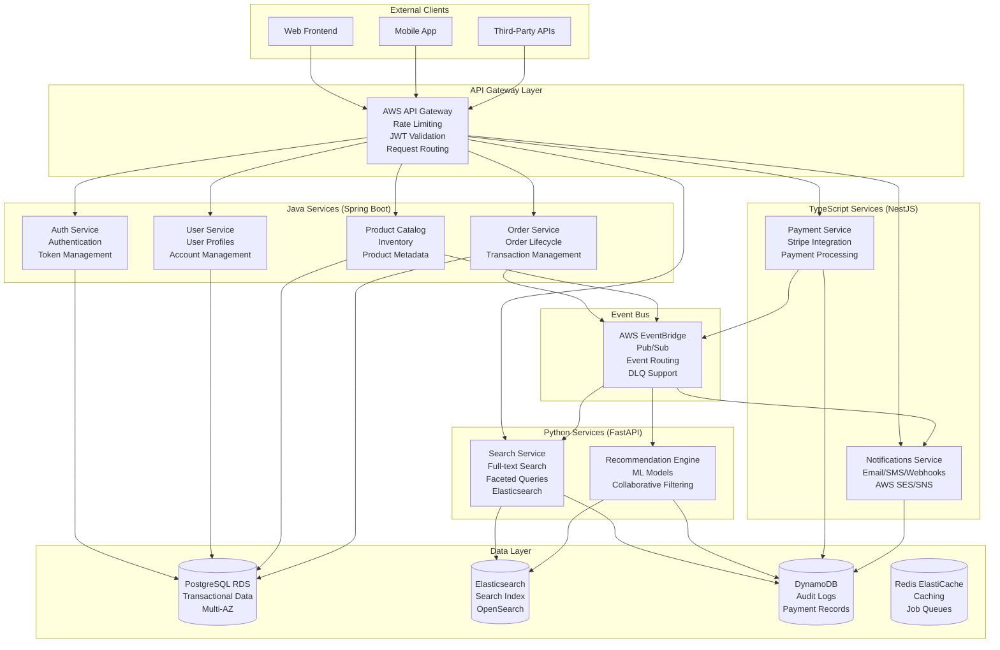

# Online Bookstore Microservices

[](https://github.com/your-repo/bookstore-microservices)
[](LICENSE)
[](https://adoptium.net/)
[](https://python.org)
[](https://typescriptlang.org)
[](https://docker.com)

A production-grade, polyglot microservices architecture for an online bookstore, demonstrating advanced distributed systems patterns, cloud-native deployment, and enterprise-grade observability.

## 🏗️ Architecture Overview

This system implements a **polyglot microservices architecture** using three programming languages, each chosen for domain-specific requirements:

- **Java + Spring Boot**: Core transactional services (Users, Auth, Catalog, Orders)
- **Python + FastAPI**: Search and recommendation engine with ML capabilities
- **TypeScript + NestJS**: External integrations (Payments, Notifications)

### System Components



## 🎯 Key Features

### Core Business Capabilities
- **User Management**: Registration, authentication, profile management
- **Product Catalog**: Rich product metadata, inventory management, categories
- **Order Processing**: Complete order lifecycle with transactional guarantees
- **Search & Discovery**: Full-text search, faceted filtering, recommendations
- **Payment Processing**: Secure payment handling with Stripe integration
- **Notifications**: Multi-channel notifications (email, SMS, webhooks)

### Technical Excellence
- **Polyglot Architecture**: Java, Python, TypeScript services with REST/EventBridge communication
- **Event-Driven Design**: Asynchronous workflows with AWS EventBridge
- **Production Observability**: CloudWatch, X-Ray, structured logging
- **Security First**: JWT authentication, RBAC, encrypted data
- **Cloud-Native**: AWS ECS Fargate, multi-AZ, auto-scaling
- **Infrastructure as Code**: Terraform deployments with environment management

### Performance & Reliability
- **High Availability**: Multi-AZ deployment, automatic failover
- **Scalability**: Horizontal scaling based on demand
- **Fault Tolerance**: Circuit breakers, retry logic, graceful degradation
- **Performance**: Sub-200ms read operations, sub-500ms write operations

## 🚀 Quick Start

### Prerequisites

- **Java 21** (OpenJDK)
- **Python 3.11+**
- **Node.js 18+** with TypeScript
- **Docker 24+**
- **AWS CLI** configured with appropriate credentials
- **Terraform 1.0+**

### Local Development Setup

1. **Clone the repository**
   ```bash
   git clone https://github.com/your-repo/bookstore-microservices.git
   cd bookstore-microservices
   ```

2. **Start infrastructure with Docker Compose**
   ```bash
   cd infrastructure/docker
   docker-compose up -d
   ```

3. **Build and run services**

   **Auth Service:**
   ```bash
   cd java-services/auth-service
   ./mvnw spring-boot:run
   ```

   **User Service:**
   ```bash
   cd java-services/user-service
   ./mvnw spring-boot:run
   ```

   **Product Catalog:**
   ```bash
   cd java-services/product-catalog
   ./mvnw spring-boot:run
   ```

   **Order Service:**
   ```bash
   cd java-services/order-service
   ./mvnw spring-boot:run
   ```

4. **Verify deployment**
   ```bash
   curl http://localhost:8080/api/v1/health
   ```

### AWS Deployment

1. **Configure AWS credentials**
   ```bash
   aws configure
   ```

2. **Deploy infrastructure**
   ```bash
   cd infrastructure/aws
   terraform init
   terraform plan -var-file="environments/dev/terraform.tfvars"
   terraform apply -var-file="environments/dev/terraform.tfvars"
   ```

3. **Build and push Docker images**
   ```bash
   # Build all services
   ./run-tests.sh

   # Push to ECR (requires AWS credentials)
   aws ecr get-login-password --region us-east-1 | docker login --username AWS --password-stdin <account-id>.dkr.ecr.us-east-1.amazonaws.com
   docker-compose -f infrastructure/docker/docker-compose.yml push
   ```

## 📁 Project Structure

```
bookstore-microservices/
├── specs/                          # System specifications and documentation
│   ├── Iteration 1 SYSTEM-OVERVIEW.md
│   ├── Iteration 2 DOMAIN-MODEL.md
│   ├── Iteration 3 AUTH-AUTHZ-SPEC.md
│   ├── Iteration 4 – Service Design & API Contracts Spec.md
│   ├── Iteration 5 - Order, Search & Event Flow Spec.md
│   ├── Iteration 6 - AWS Infrastructure & Deployment Specification.md
│   ├── Iteration 7 Observability, Reliability & Operations Specification.md
│   └── Iteration 8 Architectural Trade-offs & Evolution Specification.md
├── java-services/                  # Java Spring Boot microservices
│   ├── auth-service/              # Authentication and authorization
│   ├── user-service/              # User profile management
│   ├── product-catalog/           # Product inventory and catalog
│   └── order-service/             # Order processing and lifecycle
├── infrastructure/                # Infrastructure as Code
│   ├── aws/                       # Terraform AWS deployment
│   └── docker/                    # Local development with Docker Compose
├── run-tests.sh                   # Build and test script
└── create_dirs.bat               # Windows directory setup
```

## 🔧 Technology Stack

### Languages & Frameworks
- **Java 21 + Spring Boot 3.2**: Transactional business logic
- **Python 3.11 + FastAPI**: Search and ML services
- **TypeScript 5.3 + NestJS**: External integrations

### Infrastructure & Cloud
- **AWS ECS Fargate**: Container orchestration
- **AWS RDS PostgreSQL**: Transactional database
- **AWS OpenSearch**: Search and analytics
- **AWS DynamoDB**: NoSQL data store
- **AWS EventBridge**: Event-driven messaging
- **AWS API Gateway**: API management
- **AWS Cognito**: Authentication service

### Development Tools
- **Docker**: Containerization
- **Terraform**: Infrastructure as Code
- **GitHub Actions**: CI/CD pipelines
- **OpenAPI 3.1**: API documentation

### Observability
- **AWS CloudWatch**: Metrics and logs
- **AWS X-Ray**: Distributed tracing
- **Structured Logging**: JSON log format
- **Custom Dashboards**: Business and technical metrics

## 📚 API Documentation

### Service Endpoints

| Service | Base URL | Description |
|---------|----------|-------------|
| Auth | `/api/v1/auth` | Authentication and token management |
| Users | `/api/v1/users` | User profile and account management |
| Catalog | `/api/v1/products` | Product catalog and inventory |
| Orders | `/api/v1/orders` | Order processing and management |
| Search | `/api/v1/search` | Full-text search and recommendations |
| Payments | `/api/v1/payments` | Payment processing |
| Notifications | `/api/v1/notifications` | Notification management |

### Example API Calls

**Create User:**
```bash
curl -X POST http://localhost:8080/api/v1/users \
  -H "Content-Type: application/json" \
  -H "Authorization: Bearer <jwt-token>" \
  -d '{
    "email": "user@example.com",
    "firstName": "John",
    "lastName": "Doe",
    "password": "securePassword123"
  }'
```

**Search Products:**
```bash
curl -X GET "http://localhost:8080/api/v1/search?q=python&category=programming&limit=20" \
  -H "Authorization: Bearer <jwt-token>"
```

**Create Order:**
```bash
curl -X POST http://localhost:8080/api/v1/orders \
  -H "Content-Type: application/json" \
  -H "Authorization: Bearer <jwt-token>" \
  -d '{
    "userId": "user-123",
    "items": [
      {
        "productId": "prod-456",
        "quantity": 2
      }
    ],
    "shippingAddressId": "addr-789"
  }'
```

## 🔍 Monitoring & Observability

### Key Metrics
- **API Performance**: P95 response times, throughput, error rates
- **Business Metrics**: Orders/min, revenue tracking, user engagement
- **Infrastructure**: CPU/memory usage, database connections, queue depths
- **Service Health**: Circuit breaker status, dependency health

### Dashboards
- **CloudWatch Dashboards**: Real-time metrics and alerts
- **X-Ray Service Map**: Distributed tracing visualization
- **Custom Business Dashboards**: Order volume, user growth, revenue

## 🤝 Contributing

### Development Workflow

1. **Create a feature branch**
   ```bash
   git checkout -b feature/your-feature-name
   ```

2. **Run tests**
   ```bash
   ./run-tests.sh
   ```

3. **Follow coding standards**
   - Java: Google Java Style Guide
   - Python: PEP 8
   - TypeScript: Airbnb Style Guide
   - Use meaningful commit messages

4. **Submit a pull request**
   - Include tests for new functionality
   - Update documentation as needed
   - Ensure CI/CD passes

### Code Quality
- **Unit Tests**: Minimum 80% code coverage
- **Integration Tests**: Contract testing between services
- **Static Analysis**: SonarQube for code quality
- **Security Scanning**: Automated vulnerability scanning

## 📄 Documentation

### Specifications
- [System Overview](specs/Iteration%201%20SYSTEM-OVERVIEW.md) - High-level architecture and design decisions
- [Domain Model](specs/Iteration%202%20DOMAIN-MODEL.md) - Business domain and entities
- [Auth & Authorization](specs/Iteration%203%20AUTH-AUTHZ-SPEC.md) - Security and access control
- [Service Design](specs/Iteration%204%20%E2%80%93%20Service%20Design%20&%20API%20Contracts%20Spec.md) - API contracts and service interfaces
- [Event Flow](specs/Iteration%205%20-%20Order,%20Search%20&%20Event%20Flow%20Spec.md) - Asynchronous workflows
- [Infrastructure](specs/Iteration%206%20-%20AWS%20Infrastructure%20&%20Deployment%20Specification.md) - AWS deployment architecture
- [Observability](specs/Iteration%207%20Observability,%20Reliability%20&%20Operations%20Specification.md) - Monitoring and operations
- [Trade-offs](specs/Iteration%208%20Architectural%20Trade-offs%20&%20Evolution%20Specification.md) - Design decisions and evolution

### Infrastructure
- [AWS Infrastructure](infrastructure/aws/README.md) - Terraform deployment guide
- [Docker Setup](infrastructure/docker/README.md) - Local development environment

## 🔒 Security

### Authentication & Authorization
- **JWT Tokens**: Stateless authentication with refresh tokens
- **AWS Cognito**: User pool management and MFA support
- **RBAC**: Role-based access control with fine-grained permissions
- **API Gateway**: Request validation and rate limiting

### Data Protection
- **Encryption at Rest**: AES-256 for all sensitive data
- **Encryption in Transit**: TLS 1.2+ for all communications
- **Secrets Management**: AWS Secrets Manager for credentials
- **Audit Logging**: Comprehensive audit trails for compliance

## 🧪 Testing

### Test Types
- **Unit Tests**: Service-level business logic testing
- **Integration Tests**: Cross-service API contract testing
- **Contract Tests**: API specification compliance
- **Load Tests**: Performance and scalability validation
- **Chaos Engineering**: Fault injection and resilience testing

### Test Execution
```bash
# Run all tests
./run-tests.sh

# Run specific service tests
cd java-services/auth-service
mvn test

# Run integration tests
docker-compose -f infrastructure/docker/docker-compose.test.yml up --abort-on-container-exit
```

## 🚀 Deployment

### Environments
- **Development**: Single AZ, minimal resources, rapid iteration
- **Staging**: Multi-AZ, production-like, integration testing
- **Production**: High availability, security hardening, monitoring

### CI/CD Pipeline
- **GitHub Actions**: Automated testing and building
- **AWS CodePipeline**: Infrastructure deployment
- **Blue-Green Deployment**: Zero-downtime releases
- **Canary Releases**: Gradual traffic shifting

## 📞 Support

### Getting Help
- **Issues**: [GitHub Issues](https://github.com/your-repo/bookstore-microservices/issues)
- **Discussions**: [GitHub Discussions](https://github.com/your-repo/bookstore-microservices/discussions)
- **Documentation**: Check the `specs/` directory for detailed specifications

### Contact
- **Maintainers**: Platform Engineering Team
- **Security Issues**: security@bookstore.com
- **Business Inquiries**: contact@bookstore.com

## 📄 License

This project is licensed under the MIT License - see the [LICENSE](LICENSE) file for details.

---

**Built with ❤️ for demonstrating enterprise-grade microservices architecture**