# System Architecture Diagrams

This document contains comprehensive architectural diagrams for the Online Bookstore Microservices system.

## Table of Contents

1. [High-Level System Architecture](#high-level-system-architecture)
2. [Service Communication Patterns](#service-communication-patterns)
3. [Data Flow Diagrams](#data-flow-diagrams)
4. [Deployment Architecture](#deployment-architecture)
5. [Event-Driven Architecture](#event-driven-architecture)
6. [Security Architecture](#security-architecture)
7. [Monitoring and Observability](#monitoring-and-observability)

---

## High-Level System Architecture

```mermaid
graph TB
    subgraph "Client Layer"
        Web[Web Application<br/>React/Angular/Vue]
        Mobile[Mobile Apps<br/>iOS/Android]
        API[Third-Party APIs<br/>Integrations]
    end

    subgraph "Edge Layer"
        APIGW[AWS API Gateway<br/>- Rate Limiting: 100 req/s per user<br/>- JWT Token Validation<br/>- Request Routing<br/>- CORS Handling<br/>- Request/Response Transformation]
        CloudFront[AWS CloudFront<br/>- CDN for Static Assets<br/>- Global Distribution<br/>- DDoS Protection]
    end

    subgraph "Service Layer"
        subgraph "Java Services (Spring Boot)"
            Auth[Auth Service<br/>- JWT Issuance<br/>- User Authentication<br/>- Token Validation<br/>- MFA Support]
            User[User Service<br/>- User Profiles<br/>- Account Management<br/>- Preferences<br/>- Address Book]
            Catalog[Product Catalog<br/>- Product Metadata<br/>- Inventory Management<br/>- Categories<br/>- Pricing]
            Order[Order Service<br/>- Order Lifecycle<br/>- Cart Management<br/>- Transaction Processing<br/>- Fulfillment]
        end

        subgraph "Python Services (FastAPI)"
            Search[Search Service<br/>- Full-text Search<br/>- Faceted Filtering<br/>- Query Optimization<br/>- Elasticsearch Integration]
            RecSys[Recommendation Engine<br/>- Collaborative Filtering<br/>- ML Models<br/>- User Behavior Analysis<br/>- A/B Testing]
        end

        subgraph "TypeScript Services (NestJS)"
            Payment[Payment Service<br/>- Stripe Integration<br/>- PCI Compliance<br/>- Payment Processing<br/>- Refund Handling]
            Notify[Notifications Service<br/>- Email (AWS SES)<br/>- SMS (AWS SNS)<br/>- Webhooks<br/>- Queue Processing]
        end
    end

    subgraph "Data Layer"
        Postgres[(PostgreSQL RDS<br/>- Multi-AZ Deployment<br/>- ACID Transactions<br/>- Automated Backups<br/>- Read Replicas)]
        Elastic[(Elasticsearch/OpenSearch<br/>- Full-text Indexing<br/>- Real-time Search<br/>- Analytics<br/>- Multi-AZ)]
        Dynamo[(DynamoDB<br/>- NoSQL Audit Logs<br/>- Payment Records<br/>- Global Tables<br/>- Streams)]
        Redis[(Redis ElastiCache<br/>- Session Caching<br/>- Job Queues<br/>- Rate Limiting<br/>- Cache Warming)]
    end

    subgraph "Integration Layer"
        EventBridge[AWS EventBridge<br/>- Event Pub/Sub<br/>- Cross-Service Communication<br/>- Event Replay<br/>- Dead Letter Queues]
        SQS[(SQS Queues<br/>- Async Processing<br/>- Message Buffering<br/>- Error Handling)]
        SNS[(SNS Topics<br/>- Fan-out Messaging<br/>- Email/SMS Delivery<br/>- Webhook Notifications)]
    end

    subgraph "Infrastructure Layer"
        ECS[AWS ECS Fargate<br/>- Container Orchestration<br/>- Auto-scaling<br/>- Service Discovery<br/>- Rolling Updates]
        VPC[AWS VPC<br/>- Network Isolation<br/>- Security Groups<br/>- NAT Gateway<br/>- VPC Endpoints]
        CloudWatch[AWS CloudWatch<br/>- Metrics Collection<br/>- Log Aggregation<br/>- Alerting<br/>- Dashboards]
        XRay[AWS X-Ray<br/>- Distributed Tracing<br/>- Performance Analysis<br/>- Service Dependencies<br/>- Error Tracking]
    end

    Web --> CloudFront
    Mobile --> APIGW
    API --> APIGW

    CloudFront --> APIGW

    APIGW --> Auth
    APIGW --> User
    APIGW --> Catalog
    APIGW --> Order
    APIGW --> Search
    APIGW --> Payment

    Auth --> Postgres
    User --> Postgres
    Catalog --> Postgres
    Order --> Postgres

    Search --> Elastic
    RecSys --> Elastic

    Payment --> Dynamo
    Notify --> Dynamo

    Search --> Dynamo
    RecSys --> Dynamo

    Order --> EventBridge
    Payment --> EventBridge
    Catalog --> EventBridge
    Auth --> EventBridge

    EventBridge --> Notify
    EventBridge --> Search
    EventBridge --> RecSys

    Notify --> SQS
    Notify --> SNS

    Payment --> Redis

    ECS -.-> CloudWatch
    ECS -.-> XRay

    Postgres -.-> CloudWatch
    Elastic -.-> CloudWatch
    Dynamo -.-> CloudWatch
    Redis -.-> CloudWatch

    classDef clientLayer fill:#e1f5fe,stroke:#01579b
    classDef edgeLayer fill:#f3e5f5,stroke:#4a148c
    classDef serviceLayer fill:#e8f5e8,stroke:#1b5e20
    classDef dataLayer fill:#fff3e0,stroke:#e65100
    classDef integrationLayer fill:#fce4ec,stroke:#880e4f
    classDef infraLayer fill:#f5f5f5,stroke:#424242

    class Web,Mobile,API clientLayer
    class APIGW,CloudFront edgeLayer
    class Auth,User,Catalog,Order,Search,RecSys,Payment,Notify serviceLayer
    class Postgres,Elastic,Dynamo,Redis dataLayer
    class EventBridge,SQS,SNS integrationLayer
    class ECS,VPC,CloudWatch,XRay infraLayer
```

---

## Service Communication Patterns

### Synchronous Communication (REST APIs)


### Asynchronous Communication (Event-Driven)


---

## Data Flow Diagrams

### Order Creation Data Flow


### Search Request Data Flow


---

## Deployment Architecture

### AWS Multi-AZ Deployment


### Blue-Green Deployment Architecture


---

## Event-Driven Architecture

### Event Flow Architecture


### Event Processing Patterns


---

## Security Architecture

### Authentication & Authorization Flow


### Data Security Architecture


---

## Monitoring and Observability

### Observability Architecture


### Service Health Monitoring

```mermaid
flowchart TD
    subgraph "Health Checks"
        A[ECS Health Checks] --> B[Container Health]
        C[Application Health] --> D[Spring Boot Actuator]
        E[Dependency Health] --> F[Database Connections]
        G[External Service Health] --> H[Stripe API Status]
    end

    subgraph "Metrics Collection"
        I[Application Metrics] --> J[Request Count]
        K[Performance Metrics] --> L[Response Time P95]
        M[Error Metrics] --> N[Error Rate %]
        O[Business Metrics] --> P[Orders per Minute]
    end

    subgraph "Alerting Rules"
        Q[Critical Alerts] --> R[Service Down > 5min]
        S[Warning Alerts] --> T[High Error Rate > 5%]
        U[Performance Alerts] --> V[Response Time > 500ms]
        W[Capacity Alerts] --> X[CPU Usage > 80%]
    end

    subgraph "Incident Response"
        Y[Alert Triggered] --> Z[PagerDuty Notification]
        AA[SNS Topic] --> BB[Email/SMS Alert]
        CC[Auto-remediation] --> DD[ECS Service Restart]
        EE[Manual Response] --> FF[Runbook Execution]
    end

    B --> I
    D --> I
    F --> I
    H --> I

    J --> Q
    L --> U
    N --> S
    P --> W

    R --> Y
    T --> Y
    V --> Y
    X --> Y

    Y --> Z
    Y --> AA

    Z --> EE
    AA --> CC
    CC --> DD

    classDef health fill:#e8f5e8,stroke:#2e7d32
    classDef metrics fill:#e3f2fd,stroke:#1976d2
    classDef alerts fill:#fff3e0,stroke:#ef6c00
    classDef response fill:#fce4ec,stroke:#c2185b

    class A,B,C,D,E,F,G,H health
    class I,J,K,L,M,N,O,P metrics
    class Q,R,S,T,U,V,W,X alerts
    class Y,Z,AA,BB,CC,DD,EE,FF response
```



---

## Key Architecture Patterns Illustrated

### 1. **Polyglot Microservices Pattern**
- Java for transactional services requiring strong consistency
- Python for ML and search workloads
- TypeScript for I/O-bound integrations

### 2. **Event-Driven Architecture**
- Loose coupling between services
- Asynchronous processing for scalability
- Eventual consistency across service boundaries

### 3. **API Gateway Pattern**
- Single entry point for all client requests
- Cross-cutting concerns (auth, rate limiting, logging)
- Request/response transformation

### 4. **Database per Service Pattern**
- PostgreSQL for transactional data (users, orders, catalog)
- Elasticsearch for search-optimized data
- DynamoDB for audit logs and payment records
- Redis for caching and session management

### 5. **Circuit Breaker Pattern**
- Prevents cascade failures
- Graceful degradation under load
- Automatic recovery when services heal

### 6. **Observer Pattern for Monitoring**
- Comprehensive observability across all services
- Real-time dashboards and alerting
- Distributed tracing for debugging

This architecture demonstrates enterprise-grade patterns suitable for high-traffic e-commerce applications with complex business requirements.
