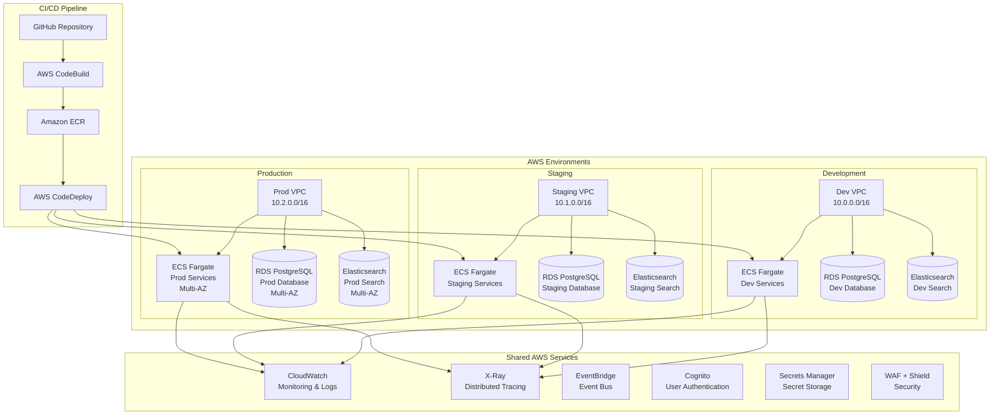

# Deployment Guide

This guide covers the deployment of the Online Bookstore Microservices system to AWS using Infrastructure as Code and CI/CD pipelines.

## Table of Contents

1. [Overview](#overview)
2. [Prerequisites](#prerequisites)
3. [Environment Setup](#environment-setup)
4. [Infrastructure Deployment](#infrastructure-deployment)
5. [Application Deployment](#application-deployment)
6. [CI/CD Pipeline](#cicd-pipeline)
7. [Monitoring Setup](#monitoring-setup)
8. [Security Configuration](#security-configuration)
9. [Backup and Recovery](#backup-and-recovery)
10. [Troubleshooting](#troubleshooting)

---

## Overview

### Deployment Architecture

The system is deployed using a multi-environment, multi-AZ AWS architecture:



### Deployment Strategy

- **Blue-Green Deployment**: Zero-downtime deployments with instant rollback
- **Multi-Environment**: Dev → Staging → Production promotion
- **Infrastructure as Code**: Terraform for reproducible deployments
- **Container Orchestration**: AWS ECS Fargate for serverless containers
- **Automated Pipelines**: GitHub Actions + AWS CodePipeline

---

## Prerequisites

### AWS Account Requirements

- **AWS Account** with necessary permissions
- **IAM User/Role** with the following permissions:
  - ECS full access
  - ECR full access
  - RDS full access
  - CloudFormation full access
  - IAM full access
  - VPC full access

### Required Tools

| Tool | Version | Purpose |
|------|---------|---------|
| **Terraform** | 1.0+ | Infrastructure as Code |
| **AWS CLI** | 2.0+ | AWS resource management |
| **Docker** | 24.0+ | Container building |
| **Git** | 2.30+ | Version control |
| **Make** | 4.0+ | Build automation |

### Domain and SSL

- **Domain Name**: Registered domain (e.g., bookstore.com)
- **SSL Certificate**: AWS Certificate Manager certificate
- **Route 53**: DNS management

### Verification

```bash
# Verify AWS CLI configuration
aws sts get-caller-identity

# Verify Terraform installation
terraform version

# Verify Docker installation
docker --version

# Check AWS region
aws configure get region
```

---

## Environment Setup

### 1. Clone Repository

```bash
git clone https://github.com/your-org/bookstore-microservices.git
cd bookstore-microservices
```

### 2. Configure AWS Credentials

```bash
# Configure AWS CLI
aws configure

# Set environment variables (optional)
export AWS_REGION=us-east-1
export AWS_PROFILE=bookstore-deploy
```

### 3. Set Up Terraform Backend

Create S3 bucket for Terraform state:

```bash
# Create S3 bucket for Terraform state
aws s3 mb s3://bookstore-terraform-state --region us-east-1

# Enable versioning
aws s3api put-bucket-versioning \
    --bucket bookstore-terraform-state \
    --versioning-configuration Status=Enabled

# Create DynamoDB table for state locking
aws dynamodb create-table \
    --table-name bookstore-terraform-locks \
    --attribute-definitions AttributeName=LockID,AttributeType=S \
    --key-schema AttributeName=LockID,KeyType=HASH \
    --billing-mode PAY_PER_REQUEST
```

### 4. Environment Configuration

Create environment-specific configuration files:

```bash
# Development environment
cp infrastructure/aws/terraform.tfvars.example environments/dev/terraform.tfvars

# Staging environment
cp infrastructure/aws/terraform.tfvars.example environments/staging/terraform.tfvars

# Production environment
cp infrastructure/aws/terraform.tfvars.example environments/prod/terraform.tfvars
```

Example `environments/dev/terraform.tfvars`:

```hcl
# Environment settings
environment = "dev"
aws_region  = "us-east-1"

# VPC Configuration
vpc_cidr_block = "10.0.0.0/16"
availability_zones = ["us-east-1a", "us-east-1b"]

# ECS Configuration
ecs_task_cpu = "256"
ecs_task_memory = "512"

# RDS Configuration
rds_instance_class = "db.t3.micro"
rds_allocated_storage = 20

# Domain Configuration
domain_name = "dev.bookstore.com"

# Tags
tags = {
  Environment = "dev"
  Project     = "bookstore"
  Owner       = "platform-team"
}
```

---

## Infrastructure Deployment

### 1. Initialize Terraform

```bash
cd infrastructure/aws

# Initialize Terraform with remote state
terraform init \
    -backend-config="bucket=bookstore-terraform-state" \
    -backend-config="key=bookstore/dev/terraform.tfstate" \
    -backend-config="region=us-east-1" \
    -backend-config="dynamodb_table=bookstore-terraform-locks"
```

### 2. Plan Deployment

```bash
# Development environment
terraform plan -var-file="environments/dev/terraform.tfvars"

# Review the plan output carefully
# Look for:
# - Resources to be created
# - Security implications
# - Cost implications
```

### 3. Apply Infrastructure

```bash
# Development environment
terraform apply -var-file="environments/dev/terraform.tfvars"

# Type 'yes' to confirm deployment
```

### 4. Verify Infrastructure

```bash
# Check ECS clusters
aws ecs list-clusters

# Check RDS instances
aws rds describe-db-instances --db-instance-identifier bookstore-dev

# Check VPC and subnets
aws ec2 describe-vpcs --filters Name=tag:Environment,Values=dev

# Check security groups
aws ec2 describe-security-groups --filters Name=tag:Environment,Values=dev
```

### 5. Deploy to Other Environments

```bash
# Initialize staging
terraform init \
    -backend-config="bucket=bookstore-terraform-state" \
    -backend-config="key=bookstore/staging/terraform.tfstate" \
    -backend-config="region=us-east-1" \
    -backend-config="dynamodb_table=bookstore-terraform-locks"

# Deploy staging
terraform apply -var-file="environments/staging/terraform.tfvars"

# Initialize production
terraform init \
    -backend-config="bucket=bookstore-terraform-state" \
    -backend-config="key=bookstore/prod/terraform.tfstate" \
    -backend-config="region=us-east-1" \
    -backend-config="dynamodb_table=bookstore-terraform-locks"

# Deploy production
terraform apply -var-file="environments/prod/terraform.tfvars"
```

### Infrastructure Components

#### VPC and Networking
- **VPC**: Isolated network environment
- **Subnets**: Public and private subnets across 2-3 AZs
- **NAT Gateway**: Outbound internet access for private subnets
- **Internet Gateway**: Public subnet internet access
- **VPC Endpoints**: Secure access to AWS services

#### Security Groups
- **ALB Security Group**: Allows HTTP/HTTPS from anywhere
- **ECS Security Group**: Allows traffic from ALB only
- **RDS Security Group**: Allows PostgreSQL from ECS only
- **Redis Security Group**: Allows Redis from ECS only

#### Load Balancing
- **Application Load Balancer**: Layer 7 load balancing
- **Target Groups**: Service-specific routing
- **Health Checks**: Automatic service health monitoring
- **SSL Termination**: TLS certificate management

---

## Application Deployment

### 1. Build Docker Images

```bash
# Build all services
./run-tests.sh

# Or build individual services
cd java-services/auth-service
docker build -t bookstore/auth-service:latest .

cd ../user-service
docker build -t bookstore/user-service:latest .

# And so on for other services...
```

### 2. Push to Amazon ECR

```bash
# Get AWS account ID
ACCOUNT_ID=$(aws sts get-caller-identity --query Account --output text)
REGION=us-east-1

# Create ECR repositories
aws ecr create-repository --repository-name bookstore/auth-service --region $REGION
aws ecr create-repository --repository-name bookstore/user-service --region $REGION
# ... create for all services

# Authenticate Docker with ECR
aws ecr get-login-password --region $REGION | docker login --username AWS --password-stdin $ACCOUNT_ID.dkr.ecr.$REGION.amazonaws.com

# Tag and push images
docker tag bookstore/auth-service:latest $ACCOUNT_ID.dkr.ecr.$REGION.amazonaws.com/bookstore/auth-service:latest
docker push $ACCOUNT_ID.dkr.ecr.$REGION.amazonaws.com/bookstore/auth-service:latest

# Repeat for all services
```

### 3. Deploy to ECS

#### Using AWS CLI

```bash
# Update service with new image
aws ecs update-service \
    --cluster bookstore-dev \
    --service auth-service \
    --force-new-deployment \
    --region $REGION
```

#### Using Terraform (Recommended)

```bash
# Update image tag in terraform variables
# environments/dev/terraform.tfvars
auth_service_image_tag = "v1.2.3"

# Apply changes
terraform apply -var-file="environments/dev/terraform.tfvars"
```

### 4. Blue-Green Deployment

```bash
# Create green environment (new version)
terraform apply -var-file="environments/dev/green.tfvars"

# Test green environment
# - Run integration tests
# - Manual testing
# - Performance testing

# Switch traffic to green
aws elbv2 modify-listener \
    --listener-arn $LISTENER_ARN \
    --default-actions Type=forward,TargetGroupArn=$GREEN_TG_ARN

# Monitor for issues
# If issues found, rollback:
aws elbv2 modify-listener \
    --listener-arn $LISTENER_ARN \
    --default-actions Type=forward,TargetGroupArn=$BLUE_TG_ARN

# If successful, update blue to match green
terraform apply -var-file="environments/dev/blue.tfvars"
```

### 5. Database Migrations

```bash
# Run migrations for each service
cd java-services/auth-service
./mvnw flyway:migrate -Dflyway.configFiles=src/main/resources/db/flyway.conf

# Or use AWS CodeBuild for automated migrations
```

---

## CI/CD Pipeline

### GitHub Actions Pipeline

```yaml
# .github/workflows/deploy.yml
name: Deploy to AWS

on:
  push:
    branches: [ main, develop ]
  pull_request:
    branches: [ main ]

env:
  AWS_REGION: us-east-1
  ECR_REPOSITORY: bookstore

jobs:
  test:
    runs-on: ubuntu-latest
    steps:
      - uses: actions/checkout@v3

      - name: Set up JDK 21
        uses: actions/setup-java@v3
        with:
          java-version: '21'
          distribution: 'temurin'

      - name: Run tests
        run: ./run-tests.sh

  build-and-push:
    needs: test
    runs-on: ubuntu-latest
    if: github.ref == 'refs/heads/main'

    steps:
      - uses: actions/checkout@v3

      - name: Configure AWS credentials
        uses: aws-actions/configure-aws-credentials@v2
        with:
          aws-access-key-id: ${{ secrets.AWS_ACCESS_KEY_ID }}
          aws-secret-access-key: ${{ secrets.AWS_SECRET_ACCESS_KEY }}
          aws-region: ${{ env.AWS_REGION }}

      - name: Login to Amazon ECR
        id: login-ecr
        uses: aws-actions/amazon-ecr-login@v1

      - name: Build and push Docker images
        run: |
          # Build and push auth-service
          docker build -t ${{ env.ECR_REPOSITORY }}/auth-service:${{ github.sha }} java-services/auth-service
          docker push ${{ env.ECR_REPOSITORY }}/auth-service:${{ github.sha }}

          # Repeat for other services...

  deploy-dev:
    needs: build-and-push
    runs-on: ubuntu-latest
    environment: dev

    steps:
      - uses: actions/checkout@v3

      - name: Configure AWS credentials
        uses: aws-actions/configure-aws-credentials@v2
        with:
          aws-access-key-id: ${{ secrets.AWS_ACCESS_KEY_ID }}
          aws-secret-access-key: ${{ secrets.AWS_SECRET_ACCESS_KEY }}
          aws-region: ${{ env.AWS_REGION }}

      - name: Deploy to Development
        run: |
          cd infrastructure/aws
          terraform init -backend-config="bucket=bookstore-terraform-state" \
                        -backend-config="key=bookstore/dev/terraform.tfstate"
          terraform apply -var-file="environments/dev/terraform.tfvars" \
                         -var="auth_service_image_tag=${{ github.sha }}" \
                         -auto-approve

  deploy-staging:
    needs: deploy-dev
    runs-on: ubuntu-latest
    environment: staging
    if: github.ref == 'refs/heads/main'

    steps:
      # Similar to dev deployment but for staging
      - name: Deploy to Staging
        run: |
          # Staging deployment steps

  deploy-prod:
    needs: deploy-staging
    runs-on: ubuntu-latest
    environment: production
    if: github.ref == 'refs/heads/main' && github.event_name == 'push'

    steps:
      # Production deployment with approval
      - name: Deploy to Production
        run: |
          # Production deployment steps
```

### AWS CodePipeline Alternative

For more complex deployments, use AWS CodePipeline:

```yaml
# AWS CodePipeline configuration
AWSTemplateFormatVersion: '2010-09-09'
Description: 'Bookstore CI/CD Pipeline'

Resources:
  BookstorePipeline:
    Type: AWS::CodePipeline::Pipeline
    Properties:
      Name: bookstore-pipeline
      RoleArn: !GetAtt PipelineRole.Arn
      Stages:
        - Name: Source
          Actions:
            - Name: SourceAction
              ActionTypeId:
                Category: Source
                Owner: AWS
                Provider: S3
                Version: '1'
              Configuration:
                S3Bucket: bookstore-artifacts
                S3ObjectKey: source.zip
              OutputArtifacts:
                - Name: SourceArtifact

        - Name: Build
          Actions:
            - Name: BuildAction
              ActionTypeId:
                Category: Build
                Owner: AWS
                Provider: CodeBuild
                Version: '1'
              Configuration:
                ProjectName: bookstore-build
              InputArtifacts:
                - Name: SourceArtifact
              OutputArtifacts:
                - Name: BuildArtifact

        - Name: DeployDev
          Actions:
            - Name: DeployDevAction
              ActionTypeId:
                Category: Deploy
                Owner: AWS
                Provider: CloudFormation
                Version: '1'
              Configuration:
                ActionMode: CREATE_UPDATE
                StackName: bookstore-dev
                TemplatePath: BuildArtifact::infrastructure/aws/main.yml
                ParameterOverrides: |
                  Environment=dev
                  ImageTag=latest

        - Name: ManualApproval
          Actions:
            - Name: ManualApprovalAction
              ActionTypeId:
                Category: Approval
                Owner: AWS
                Provider: Manual
                Version: '1'

        - Name: DeployProd
          Actions:
            - Name: DeployProdAction
              ActionTypeId:
                Category: Deploy
                Owner: AWS
                Provider: CloudFormation
                Version: '1'
              Configuration:
                ActionMode: CREATE_UPDATE
                StackName: bookstore-prod
                TemplatePath: BuildArtifact::infrastructure/aws/main.yml
                ParameterOverrides: |
                  Environment=prod
                  ImageTag=latest
```

---

## Monitoring Setup

### CloudWatch Dashboards

```bash
# Create CloudWatch dashboard
aws cloudwatch put-dashboard \
    --dashboard-name bookstore-dev \
    --dashboard-body file://monitoring/dashboard.json
```

Example dashboard configuration:

```json
{
  "widgets": [
    {
      "type": "metric",
      "properties": {
        "metrics": [
          ["AWS/ECS", "CPUUtilization", "ServiceName", "auth-service", "ClusterName", "bookstore-dev"],
          [".", "MemoryUtilization", ".", ".", ".", "."]
        ],
        "view": "timeSeries",
        "stacked": false,
        "region": "us-east-1",
        "title": "Auth Service Resources",
        "period": 300
      }
    },
    {
      "type": "log",
      "properties": {
        "query": "SOURCE '/ecs/bookstore-dev' | fields @timestamp, @message | sort @timestamp desc | limit 100",
        "region": "us-east-1",
        "title": "Application Logs"
      }
    }
  ]
}
```

### Alarms Configuration

```bash
# High error rate alarm
aws cloudwatch put-metric-alarm \
    --alarm-name "bookstore-dev-high-error-rate" \
    --alarm-description "Alert when API error rate exceeds 5%" \
    --metric-name "5xxError" \
    --namespace "AWS/ApplicationELB" \
    --statistic "Average" \
    --period 300 \
    --threshold 5 \
    --comparison-operator "GreaterThanThreshold" \
    --dimensions Name=LoadBalancer,Value=app/bookstore-dev-alb/1234567890abcdef \
    --evaluation-periods 2 \
    --alarm-actions "arn:aws:sns:us-east-1:123456789012:bookstore-alerts"
```

### X-Ray Setup

```bash
# Enable X-Ray for ECS services
aws ecs update-service \
    --cluster bookstore-dev \
    --service auth-service \
    --enable-execute-command \
    --region us-east-1
```

---

## Security Configuration

### Secrets Management

```bash
# Store database password
aws secretsmanager create-secret \
    --name "bookstore/dev/db-password" \
    --secret-string '{"password":"your-secure-password"}'

# Store JWT secret
aws secretsmanager create-secret \
    --name "bookstore/dev/jwt-secret" \
    --secret-string '{"secret":"your-jwt-secret-key"}'
```

### SSL/TLS Configuration

```bash
# Request SSL certificate
aws acm request-certificate \
    --domain-name bookstore.com \
    --validation-method DNS \
    --subject-alternative-names "*.bookstore.com"

# Update ALB to use HTTPS
aws elbv2 modify-listener \
    --listener-arn $LISTENER_ARN \
    --certificates CertificateArn=$CERTIFICATE_ARN
```

### WAF Configuration

```bash
# Create WAF WebACL
aws wafv2 create-web-acl \
    --name bookstore-waf \
    --scope REGIONAL \
    --default-action Allow={} \
    --rules file://security/waf-rules.json \
    --region us-east-1

# Associate with ALB
aws wafv2 associate-web-acl \
    --web-acl-arn $WEB_ACL_ARN \
    --resource-arn $ALB_ARN
```

---

## Backup and Recovery

### Database Backups

```bash
# Enable automated backups
aws rds modify-db-instance \
    --db-instance-identifier bookstore-dev \
    --backup-retention-period 7 \
    --preferred-backup-window "03:00-04:00" \
    --region us-east-1

# Create manual backup
aws rds create-db-snapshot \
    --db-instance-identifier bookstore-dev \
    --db-snapshot-identifier bookstore-dev-manual-2026-01-18
```

### Infrastructure Backups

```bash
# Create AMI backups of ECS instances
aws ec2 create-image \
    --instance-id $INSTANCE_ID \
    --name "bookstore-dev-ami-$(date +%Y%m%d)" \
    --description "Bookstore development AMI backup"
```

### Disaster Recovery

```bash
# Cross-region backup replication
aws rds start-db-instance-automated-backups-replication \
    --source-db-instance-arn $SOURCE_DB_ARN \
    --kms-key-id $DR_KEY_ID \
    --region us-west-2
```

### Recovery Testing

```bash
# Simulate failover
aws rds failover-db-cluster \
    --db-cluster-identifier bookstore-prod

# Test backup restoration
aws rds restore-db-instance-from-db-snapshot \
    --db-instance-identifier bookstore-dev-restore \
    --db-snapshot-identifier bookstore-dev-snapshot-2026-01-18
```

---

## Troubleshooting

### Common Deployment Issues

#### Terraform State Lock

```bash
# Force unlock if needed (use with caution)
terraform force-unlock LOCK_ID

# Check current locks
aws dynamodb scan --table-name bookstore-terraform-locks
```

#### ECS Service Deployment Failures

```bash
# Check service events
aws ecs describe-services \
    --cluster bookstore-dev \
    --services auth-service

# Check task definition
aws ecs describe-task-definition \
    --task-definition auth-service:1

# View container logs
aws logs tail /ecs/bookstore-dev --follow
```

#### Database Connection Issues

```bash
# Test database connectivity
aws rds describe-db-instances \
    --db-instance-identifier bookstore-dev

# Check security groups
aws ec2 describe-security-groups \
    --group-ids $DB_SECURITY_GROUP_ID
```

#### Load Balancer Issues

```bash
# Check ALB health
aws elbv2 describe-target-health \
    --target-group-arn $TARGET_GROUP_ARN

# Check ALB access logs
aws s3 ls s3://bookstore-logs/access-logs/
```

### Performance Issues

#### High CPU/Memory Usage

```bash
# Check ECS service metrics
aws cloudwatch get-metric-statistics \
    --namespace AWS/ECS \
    --metric-name CPUUtilization \
    --dimensions Name=ServiceName,Value=auth-service Name=ClusterName,Value=bookstore-dev \
    --start-time 2026-01-18T00:00:00Z \
    --end-time 2026-01-18T23:59:59Z \
    --period 300 \
    --statistics Average

# Scale service up
aws ecs update-service \
    --cluster bookstore-dev \
    --service auth-service \
    --desired-count 3
```

#### Slow API Responses

```bash
# Enable X-Ray tracing
aws ecs update-service \
    --cluster bookstore-dev \
    --service auth-service \
    --enable-execute-command

# Check X-Ray traces
aws xray get-trace-summaries \
    --start-time 2026-01-18T00:00:00Z \
    --end-time 2026-01-18T23:59:59Z
```

### Rollback Procedures

#### Emergency Rollback

```bash
# Rollback to previous deployment
aws ecs update-service \
    --cluster bookstore-prod \
    --service auth-service \
    --task-definition auth-service:5 \
    --force-new-deployment

# Or rollback infrastructure
cd infrastructure/aws
terraform apply -var-file="environments/prod/rollback.tfvars"
```

#### Gradual Rollback

```bash
# Blue-green rollback
aws elbv2 modify-listener \
    --listener-arn $LISTENER_ARN \
    --default-actions Type=forward,TargetGroupArn=$BLUE_TG_ARN
```

### Monitoring During Deployment

```bash
# Monitor deployment progress
aws ecs describe-services \
    --cluster bookstore-dev \
    --services auth-service \
    --query 'services[0].deployments[]'

# Check CloudWatch alarms
aws cloudwatch describe-alarms \
    --alarm-names-prefix "bookstore-dev" \
    --state-value ALARM
```

### Log Analysis

```bash
# Search for errors in logs
aws logs filter-log-events \
    --log-group-name /ecs/bookstore-dev \
    --filter-pattern "ERROR" \
    --start-time $(date -d '1 hour ago' +%s)000

# Export logs for analysis
aws logs create-export-task \
    --log-group-name /ecs/bookstore-dev \
    --from $(date -d '1 day ago' +%s)000 \
    --to $(date +%s)000 \
    --destination s3://bookstore-logs/exports/
```

---

## Cost Optimization

### Reserved Instances

```bash
# Purchase RDS reserved instance
aws rds purchase-reserved-db-instances-offering \
    --reserved-db-instances-offering-id $OFFERING_ID \
    --db-instance-count 1 \
    --reserved-db-instance-id bookstore-prod-reserved
```

### Auto Scaling

```bash
# Configure ECS auto scaling
aws application-autoscaling register-scalable-target \
    --service-namespace ecs \
    --scalable-dimension ecs:service:DesiredCount \
    --resource-id service/bookstore-prod/auth-service \
    --min-capacity 2 \
    --max-capacity 10

aws application-autoscaling put-scaling-policy \
    --policy-name auth-service-cpu-scaling \
    --service-namespace ecs \
    --resource-id service/bookstore-prod/auth-service \
    --scalable-dimension ecs:service:DesiredCount \
    --policy-type TargetTrackingScaling \
    --target-tracking-scaling-policy-configuration file://scaling/cpu-policy.json
```

### Resource Tagging

```bash
# Tag resources for cost allocation
aws ec2 create-tags \
    --resources $INSTANCE_ID \
    --tags Key=Environment,Value=prod Key=Project,Value=bookstore Key=Owner,Value=platform-team
```

This deployment guide provides a comprehensive approach to deploying the Bookstore microservices system with enterprise-grade reliability, security, and operational excellence.