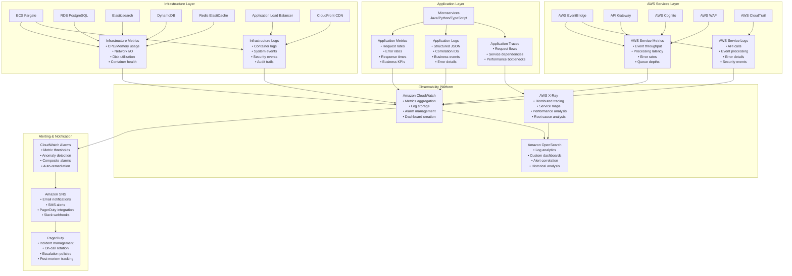
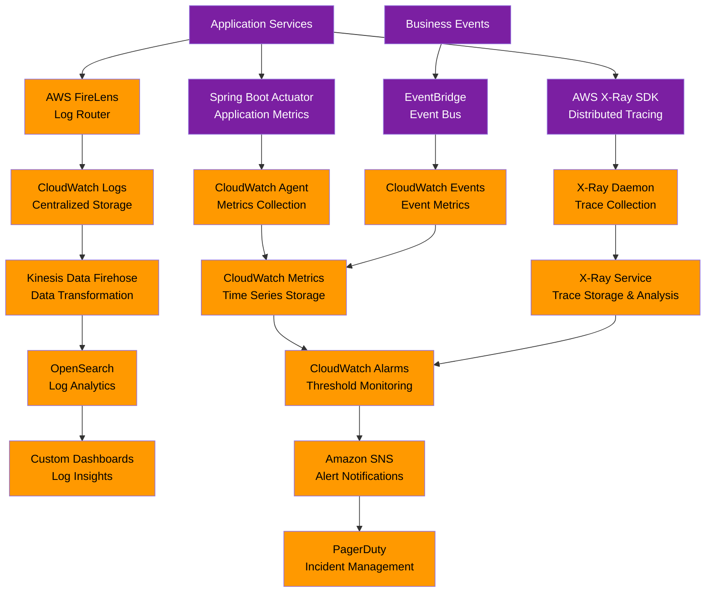
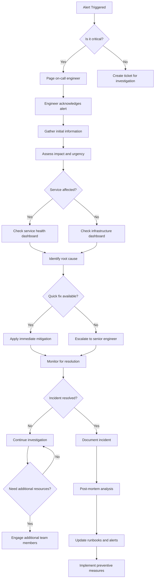

# Monitoring and Observability Guide

This guide covers the comprehensive monitoring and observability setup for the Online Bookstore Microservices system, enabling proactive issue detection, performance optimization, and operational excellence.

## Table of Contents

1. [Overview](#overview)
2. [Monitoring Architecture](#monitoring-architecture)
3. [Key Metrics](#key-metrics)
4. [Logging Strategy](#logging-strategy)
5. [Distributed Tracing](#distributed-tracing)
6. [Alerting](#alerting)
7. [Dashboards](#dashboards)
8. [Performance Monitoring](#performance-monitoring)
9. [Incident Response](#incident-response)
10. [Monitoring as Code](#monitoring-as-code)

---

## Overview

### Observability Principles

The system implements **observability first** principles with three pillars:

1. **Metrics**: Quantitative measurements of system behavior
2. **Logs**: Structured records of discrete events
3. **Traces**: Request flow through distributed systems

### Monitoring Coverage



### Service Level Objectives (SLOs)

| Service | Availability SLO | Latency SLO | Error Budget |
|---------|------------------|-------------|--------------|
| **API Gateway** | 99.9% | P95 < 200ms | < 0.1% |
| **Auth Service** | 99.9% | P95 < 500ms | < 0.1% |
| **User Service** | 99.9% | P95 < 300ms | < 0.1% |
| **Product Catalog** | 99.95% | P95 < 200ms | < 0.05% |
| **Order Service** | 99.9% | P95 < 500ms | < 0.1% |
| **Search Service** | 99.5% | P95 < 300ms | < 0.5% |
| **Payment Service** | 99.9% | P95 < 1000ms | < 0.1% |
| **Notifications** | 99.5% | P95 < 2000ms | < 0.5% |

---

## Monitoring Architecture

### Centralized Observability Stack



### Data Flow Patterns

#### Metrics Collection
1. **Application Metrics**: Spring Boot Actuator, custom business metrics
2. **Infrastructure Metrics**: ECS, RDS, ElastiCache, DynamoDB built-in metrics
3. **AWS Service Metrics**: API Gateway, EventBridge, CloudFront metrics
4. **Custom Metrics**: Business KPIs, performance indicators

#### Log Aggregation
1. **Application Logs**: Structured JSON with correlation IDs
2. **Infrastructure Logs**: Container logs, system events
3. **AWS Service Logs**: API calls, security events via CloudTrail
4. **Audit Logs**: User actions, data access, compliance events

#### Distributed Tracing
1. **Request Tracing**: End-to-end request flow visualization
2. **Service Dependencies**: Automatic service map generation
3. **Performance Analysis**: Identify bottlenecks and slow services
4. **Root Cause Analysis**: Correlate issues across services

---

## Key Metrics

### Application Performance Metrics

#### HTTP Request Metrics

```json
{
  "Namespace": "Bookstore/API",
  "Metrics": [
    {
      "Name": "RequestCount",
      "Dimensions": [
        {"Name": "Service", "Value": "auth-service"},
        {"Name": "Method", "Value": "POST"},
        {"Name": "Endpoint", "Value": "/login"}
      ],
      "Value": 150,
      "Unit": "Count",
      "Timestamp": "2026-01-18T12:00:00Z"
    },
    {
      "Name": "ResponseTime",
      "Dimensions": [
        {"Name": "Service", "Value": "auth-service"},
        {"Name": "Percentile", "Value": "P95"}
      ],
      "Value": 245.67,
      "Unit": "Milliseconds",
      "Timestamp": "2026-01-18T12:00:00Z"
    },
    {
      "Name": "ErrorRate",
      "Dimensions": [
        {"Name": "Service", "Value": "auth-service"},
        {"Name": "ErrorType", "Value": "5xx"}
      ],
      "Value": 0.02,
      "Unit": "Percent",
      "Timestamp": "2026-01-18T12:00:00Z"
    }
  ]
}
```

#### Business Metrics

```json
{
  "Namespace": "Bookstore/Business",
  "Metrics": [
    {
      "Name": "OrdersCreated",
      "Dimensions": [
        {"Name": "Environment", "Value": "production"}
      ],
      "Value": 45,
      "Unit": "Count",
      "Timestamp": "2026-01-18T12:00:00Z"
    },
    {
      "Name": "Revenue",
      "Dimensions": [
        {"Name": "Currency", "Value": "USD"},
        {"Name": "Environment", "Value": "production"}
      ],
      "Value": 1250.50,
      "Unit": "Currency",
      "Timestamp": "2026-01-18T12:00:00Z"
    },
    {
      "Name": "UserRegistrations",
      "Dimensions": [
        {"Name": "Environment", "Value": "production"}
      ],
      "Value": 23,
      "Unit": "Count",
      "Timestamp": "2026-01-18T12:00:00Z"
    }
  ]
}
```

### Infrastructure Metrics

#### ECS Container Metrics

```json
{
  "Namespace": "AWS/ECS",
  "Metrics": [
    {
      "Name": "CPUUtilization",
      "Dimensions": [
        {"Name": "ClusterName", "Value": "bookstore-prod"},
        {"Name": "ServiceName", "Value": "auth-service"}
      ],
      "Value": 35.2,
      "Unit": "Percent",
      "Timestamp": "2026-01-18T12:00:00Z"
    },
    {
      "Name": "MemoryUtilization",
      "Dimensions": [
        {"Name": "ClusterName", "Value": "bookstore-prod"},
        {"Name": "ServiceName", "Value": "auth-service"}
      ],
      "Value": 68.7,
      "Unit": "Percent",
      "Timestamp": "2026-01-18T12:00:00Z"
    }
  ]
}
```

#### Database Metrics

```json
{
  "Namespace": "AWS/RDS",
  "Metrics": [
    {
      "Name": "DatabaseConnections",
      "Dimensions": [
        {"Name": "DBInstanceIdentifier", "Value": "bookstore-prod"}
      ],
      "Value": 12,
      "Unit": "Count",
      "Timestamp": "2026-01-18T12:00:00Z"
    },
    {
      "Name": "ReadLatency",
      "Dimensions": [
        {"Name": "DBInstanceIdentifier", "Value": "bookstore-prod"}
      ],
      "Value": 2.3,
      "Unit": "Milliseconds",
      "Timestamp": "2026-01-18T12:00:00Z"
    }
  ]
}
```

### Custom Metrics Implementation

#### Java Services (Spring Boot)

```java
@Configuration
public class MetricsConfig {

    @Autowired
    private MeterRegistry meterRegistry;

    @Bean
    public TimedAspect timedAspect(MeterRegistry registry) {
        return new TimedAspect(registry);
    }
}

// Usage in service
@Service
public class AuthService {

    private final Counter loginAttempts;
    private final Counter loginFailures;
    private final Timer loginDuration;

    public AuthService(MeterRegistry meterRegistry) {
        this.loginAttempts = Counter.builder("auth.login.attempts")
                .description("Total login attempts")
                .register(meterRegistry);

        this.loginFailures = Counter.builder("auth.login.failures")
                .description("Failed login attempts")
                .register(meterRegistry);

        this.loginDuration = Timer.builder("auth.login.duration")
                .description("Login request duration")
                .register(meterRegistry);
    }

    public LoginResponse login(LoginRequest request) {
        loginAttempts.increment();

        return loginDuration.recordCallable(() -> {
            try {
                // Authentication logic
                User user = authenticate(request.getEmail(), request.getPassword());
                String token = jwtService.generateToken(user);
                return new LoginResponse(token);
            } catch (AuthenticationException e) {
                loginFailures.increment();
                throw e;
            }
        });
    }
}
```

#### Python Services (FastAPI)

```python
from fastapi import FastAPI, Request, Response
from prometheus_client import Counter, Histogram, generate_latest
import time

app = FastAPI()

# Metrics
REQUEST_COUNT = Counter(
    'search_requests_total',
    'Total search requests',
    ['method', 'endpoint', 'status']
)

REQUEST_LATENCY = Histogram(
    'search_request_duration_seconds',
    'Search request duration',
    ['method', 'endpoint']
)

@app.middleware("http")
async def metrics_middleware(request: Request, call_next):
    start_time = time.time()

    response = await call_next(request)

    # Record metrics
    REQUEST_COUNT.labels(
        method=request.method,
        endpoint=request.url.path,
        status=response.status_code
    ).inc()

    REQUEST_LATENCY.labels(
        method=request.method,
        endpoint=request.url.path
    ).observe(time.time() - start_time)

    return response

@app.get("/metrics")
async def metrics():
    return Response(generate_latest(), media_type="text/plain")
```

---

## Logging Strategy

### Structured Logging Format

All services use consistent JSON logging format:

```json
{
  "timestamp": "2026-01-18T12:27:15.123Z",
  "level": "INFO",
  "service": "auth-service",
  "version": "1.2.3",
  "environment": "production",
  "correlationId": "req_abc123def456",
  "userId": "user_xyz789",
  "sessionId": "sess_123456",
  "requestId": "req_abc123def456",
  "method": "POST",
  "url": "/api/v1/auth/login",
  "statusCode": 200,
  "responseTime": 245,
  "userAgent": "Mozilla/5.0 (Windows NT 10.0; Win64; x64) AppleWebKit/537.36",
  "ipAddress": "192.168.1.100",
  "message": "User login successful",
  "additionalContext": {
    "loginMethod": "password",
    "mfaUsed": false,
    "accountStatus": "active"
  }
}
```

### Log Levels and Usage

| Level | Usage | Examples |
|-------|-------|----------|
| **ERROR** | System errors, exceptions | Database connection failures, external API errors |
| **WARN** | Potential issues | High memory usage, slow queries, deprecated features |
| **INFO** | Important business events | User login, order creation, payment processing |
| **DEBUG** | Detailed debugging info | Parameter values, decision branches, performance timings |
| **TRACE** | Very detailed tracing | Method entry/exit, variable values, low-level operations |

### Log Categories

#### Application Logs

```json
// Business Events
{
  "category": "business",
  "event": "user.registered",
  "userId": "user_123",
  "email": "user@example.com",
  "registrationMethod": "email"
}

// Security Events
{
  "category": "security",
  "event": "authentication.failed",
  "reason": "invalid_password",
  "ipAddress": "192.168.1.100",
  "userAgent": "Mozilla/5.0...",
  "attempts": 3
}

// Performance Logs
{
  "category": "performance",
  "operation": "database.query",
  "table": "users",
  "queryTime": 45,
  "rowCount": 1,
  "slowQuery": false
}
```

#### Infrastructure Logs

```json
// Container Logs
{
  "category": "infrastructure",
  "component": "ecs",
  "event": "container.started",
  "taskId": "task_123",
  "service": "auth-service",
  "cpuUsage": 35.2,
  "memoryUsage": 68.7
}

// Database Logs
{
  "category": "infrastructure",
  "component": "rds",
  "event": "slow_query",
  "query": "SELECT * FROM orders WHERE user_id = ?",
  "executionTime": 2500,
  "threshold": 1000
}
```

### Log Aggregation and Analysis

#### CloudWatch Insights Queries

```sql
-- Find errors in the last hour
fields @timestamp, @message, service, correlationId
| filter level = "ERROR"
| sort @timestamp desc
| limit 100

-- Analyze response times by service
fields service, responseTime
| filter ispresent(responseTime)
| stats avg(responseTime) as avgResponseTime,
         max(responseTime) as maxResponseTime,
         pct(responseTime, 95) as p95ResponseTime
  by service
| sort avgResponseTime desc

-- Track user journey with correlation ID
fields @timestamp, @message, service, method, url
| filter correlationId = "req_abc123def456"
| sort @timestamp asc

-- Find security events
fields @timestamp, @message, ipAddress, userAgent
| filter category = "security"
| sort @timestamp desc
| limit 50
```

---

## Distributed Tracing

### X-Ray Integration

#### Java Services

```java
@Configuration
public class TracingConfig {

    @Bean
    public Filter tracingFilter() {
        return new AWSXRayServletFilter("auth-service");
    }

    @Bean
    public RestTemplate restTemplate() {
        return new RestTemplate();
    }
}

// Usage in service
@Service
public class UserServiceClient {

    @Autowired
    private RestTemplate restTemplate;

    public User getUser(String userId) {
        String url = "http://user-service/api/v1/users/" + userId;

        return restTemplate.getForObject(url, User.class);
    }
}
```

#### Python Services

```python
from aws_xray_sdk.core import xray_recorder
from aws_xray_sdk.ext.flask import middleware

app = Flask(__name__)
middleware.XRayMiddleware(app, xray_recorder)

@xray_recorder.capture('search_products')
def search_products(query, filters):
    with xray_recorder.in_subsegment('elasticsearch_query') as subsegment:
        subsegment.put_metadata('query', query)
        subsegment.put_metadata('filters', filters)

        # Elasticsearch search logic
        results = elasticsearch.search(query, filters)

        subsegment.put_metadata('result_count', len(results))
        return results
```

### Trace Analysis

#### Service Map Visualization

```
API Gateway → Auth Service → User Service
     ↓              ↓
     → Order Service → Product Catalog
              ↓              ↓
              → Payment Service
                     ↓
              → Notifications Service
```

#### Performance Bottlenecks

Common tracing patterns to identify:

1. **Slow Database Queries**
   - Traces showing >100ms database operations
   - N+1 query patterns
   - Missing database indexes

2. **External API Latency**
   - Slow Stripe payment processing
   - Elasticsearch search timeouts
   - Third-party service delays

3. **Service-to-Service Communication**
   - Synchronous calls causing cascading delays
   - Circuit breaker activations
   - High retry rates

#### Custom Subsegments

```java
// Java custom subsegments
try (Subsegment subsegment = AWSXRay.beginSubsegment("validatePayment")) {
    subsegment.putMetadata("amount", paymentRequest.getAmount());
    subsegment.putMetadata("currency", paymentRequest.getCurrency());

    // Payment validation logic
    boolean isValid = validatePayment(paymentRequest);

    subsegment.putMetadata("isValid", isValid);
    subsegment.setMetadata("validationResult", result);

} catch (Exception e) {
    AWSXRay.getCurrentSegment().addException(e);
    throw e;
}
```

---

## Alerting

### Alert Categories

#### Critical Alerts (Immediate Response)

```yaml
# Service Down
alert: ServiceDown
expr: up{job="bookstore"} == 0
for: 5m
labels:
  severity: critical
  category: availability
annotations:
  summary: "Service {{ $labels.service }} is down"
  description: "Service {{ $labels.service }} has been down for 5 minutes"

# High Error Rate
alert: HighErrorRate
expr: rate(http_requests_total{status=~"5.."}[5m]) / rate(http_requests_total[5m]) > 0.05
for: 5m
labels:
  severity: critical
  category: errors
annotations:
  summary: "High error rate on {{ $labels.service }}"
  description: "Error rate > 5% for {{ $labels.service }}"
```

#### Warning Alerts (Investigation Needed)

```yaml
# High Latency
alert: HighLatency
expr: histogram_quantile(0.95, rate(http_request_duration_seconds_bucket[5m])) > 1
for: 10m
labels:
  severity: warning
  category: performance
annotations:
  summary: "High latency on {{ $labels.service }}"
  description: "P95 latency > 1s for {{ $labels.service }}"

# Low Disk Space
alert: LowDiskSpace
expr: (1 - node_filesystem_avail_bytes / node_filesystem_size_bytes) * 100 > 85
for: 5m
labels:
  severity: warning
  category: infrastructure
annotations:
  summary: "Low disk space on {{ $labels.instance }}"
  description: "Disk usage > 85% on {{ $labels.instance }}"
```

#### Info Alerts (Monitoring)

```yaml
# Deployment Started
alert: DeploymentStarted
expr: deployment_status{status="started"} == 1
labels:
  severity: info
  category: deployment
annotations:
  summary: "Deployment started for {{ $labels.service }}"
  description: "New deployment initiated for {{ $labels.service }}"

# Security Event
alert: SecurityEvent
expr: security_events_total{type="failed_login"} > 5
for: 5m
labels:
  severity: info
  category: security
annotations:
  summary: "Multiple failed login attempts"
  description: "5+ failed login attempts in 5 minutes from {{ $labels.ip }}"
```

### Alert Routing

```yaml
# Critical alerts go to on-call engineer
routes:
  - match:
      severity: critical
    receiver: 'pagerduty-critical'
    continue: true

  - match:
      severity: warning
    receiver: 'slack-warnings'
    continue: true

  - match:
      severity: info
    receiver: 'email-info'
    continue: true

# Service-specific routing
  - match:
      service: payment-service
      severity: critical
    receiver: 'pagerduty-payment'
    continue: false
```

### Auto-Remediation

```yaml
# Auto-scale on high CPU
alert: HighCPUUsage
expr: cpu_usage_percent > 80
for: 10m
labels:
  severity: warning
annotations:
  summary: "High CPU usage on {{ $labels.instance }}"
  runbook_url: "https://docs.bookstore.com/runbooks/high-cpu"

# Auto-restart on service crashes
alert: ServiceCrash
expr: up{job="bookstore"} == 0
for: 5m
labels:
  severity: critical
  auto_restart: "true"
annotations:
  summary: "Service {{ $labels.service }} crashed"
  auto_remediation: "ECS service will be restarted automatically"
```

---

## Dashboards

### Executive Dashboard

```json
{
  "widgets": [
    {
      "type": "metric",
      "properties": {
        "metrics": [
          ["Bookstore/Business", "Revenue", { "color": "#2E7D32" }],
          ["Bookstore/Business", "OrdersCreated", { "color": "#1976D2" }],
          ["Bookstore/Business", "UserRegistrations", { "color": "#F57C00" }]
        ],
        "title": "Business Metrics",
        "view": "timeSeries",
        "stacked": false
      }
    },
    {
      "type": "metric",
      "properties": {
        "metrics": [
          ["AWS/ApplicationELB", "RequestCount", "LoadBalancer", "bookstore-prod-alb"],
          ["AWS/ApplicationELB", "HTTPCode_Target_5XX_Count", ".", "."],
          ["AWS/ApplicationELB", "TargetResponseTime", ".", "."]
        ],
        "title": "API Performance",
        "view": "timeSeries"
      }
    }
  ]
}
```

### Service Health Dashboard

```json
{
  "widgets": [
    {
      "type": "metric",
      "properties": {
        "metrics": [
          ["AWS/ECS", "CPUUtilization", "ServiceName", "auth-service", "ClusterName", "bookstore-prod", { "label": "Auth CPU" }],
          ["AWS/ECS", "CPUUtilization", "ServiceName", "user-service", "ClusterName", "bookstore-prod", { "label": "User CPU" }],
          ["AWS/ECS", "CPUUtilization", "ServiceName", "order-service", "ClusterName", "bookstore-prod", { "label": "Order CPU" }],
          ["AWS/ECS", "CPUUtilization", "ServiceName", "product-catalog", "ClusterName", "bookstore-prod", { "label": "Catalog CPU" }]
        ],
        "title": "Service CPU Utilization",
        "view": "timeSeries"
      }
    },
    {
      "type": "log",
      "properties": {
        "query": "SOURCE '/ecs/bookstore-prod' | fields @timestamp, service, level, message | filter level in ['ERROR', 'WARN'] | sort @timestamp desc | limit 50",
        "title": "Recent Errors and Warnings",
        "region": "us-east-1"
      }
    }
  ]
}
```

### Infrastructure Dashboard

```json
{
  "widgets": [
    {
      "type": "metric",
      "properties": {
        "metrics": [
          ["AWS/RDS", "DatabaseConnections", "DBInstanceIdentifier", "bookstore-prod"],
          ["AWS/RDS", "ReadLatency", ".", "."],
          ["AWS/RDS", "WriteLatency", ".", "."]
        ],
        "title": "Database Performance",
        "view": "timeSeries"
      }
    },
    {
      "type": "metric",
      "properties": {
        "metrics": [
          ["AWS/ElastiCache", "CPUUtilization", "CacheClusterId", "bookstore-prod-redis"],
          ["AWS/ElastiCache", "CurrConnections", ".", "."],
          ["AWS/ElastiCache", "CacheHits", ".", "."],
          ["AWS/ElastiCache", "CacheMisses", ".", "."]
        ],
        "title": "Redis Performance",
        "view": "timeSeries"
      }
    }
  ]
}
```

---

## Performance Monitoring

### Application Performance Monitoring (APM)

#### Key Performance Indicators

1. **Response Time Breakdown**
   - API Gateway latency
   - Service processing time
   - Database query time
   - External API calls

2. **Throughput Metrics**
   - Requests per second
   - Transactions per minute
   - Data transfer rates

3. **Resource Utilization**
   - CPU usage patterns
   - Memory consumption
   - Network I/O
   - Disk I/O

#### Performance Profiling

```java
// Java performance profiling
@Timed(value = "order.create", percentiles = {0.5, 0.95, 0.99})
public Order createOrder(CreateOrderRequest request) {
    // Business logic
}

@Service
public class PerformanceMonitor {

    @Autowired
    private MeterRegistry meterRegistry;

    public void recordDatabaseQuery(String query, long durationMs) {
        Timer.builder("db.query.duration")
                .tag("query", query)
                .register(meterRegistry)
                .record(durationMs, TimeUnit.MILLISECONDS);
    }
}
```

### Database Performance Monitoring

#### Slow Query Analysis

```sql
-- Enable slow query log
SET GLOBAL slow_query_log = 'ON';
SET GLOBAL long_query_time = 1; -- Log queries > 1 second

-- Analyze slow queries
SELECT sql_text, exec_count, avg_timer_wait/1000000000 as avg_time_sec
FROM performance_schema.events_statements_summary_by_digest
WHERE avg_timer_wait > 1000000000 -- > 1 second
ORDER BY avg_timer_wait DESC
LIMIT 10;
```

#### Connection Pool Monitoring

```yaml
# HikariCP metrics
management:
  metrics:
    export:
      jmx:
        enabled: true
  endpoints:
    web:
      exposure:
        include: "hikaricp"
```

### Cache Performance Monitoring

```python
# Redis performance monitoring
import redis
from redis import Redis

class CacheMonitor:
    def __init__(self, redis_client: Redis):
        self.redis = redis_client

    def get_cache_stats(self):
        info = self.redis.info()
        return {
            'hits': info['keyspace_hits'],
            'misses': info['keyspace_misses'],
            'hit_rate': info['keyspace_hits'] / (info['keyspace_hits'] + info['keyspace_misses']),
            'connected_clients': info['connected_clients'],
            'used_memory': info['used_memory_human'],
            'evicted_keys': info['evicted_keys']
        }
```

---

## Incident Response

### Incident Response Process



### Runbooks

#### Service Restart Runbook

```markdown
# Auth Service Restart Runbook

## Symptoms
- Auth service returning 5xx errors
- High error rate in CloudWatch metrics
- ECS service shows unhealthy tasks

## Diagnosis
1. Check CloudWatch logs for error patterns
2. Verify database connectivity
3. Check Redis connectivity
4. Review recent deployments

## Resolution Steps
1. **Scale service to 0 tasks**
   ```bash
   aws ecs update-service --cluster bookstore-prod --service auth-service --desired-count 0
   ```

2. **Wait for tasks to terminate**
   ```bash
   aws ecs list-tasks --cluster bookstore-prod --service-name auth-service
   ```

3. **Scale service back to normal**
   ```bash
   aws ecs update-service --cluster bookstore-prod --service auth-service --desired-count 3
   ```

4. **Monitor service recovery**
   - Check target group health
   - Verify API responses
   - Monitor error rates

## Prevention
- Implement circuit breakers
- Add more comprehensive health checks
- Increase instance sizes if needed
```

#### Database Failover Runbook

```markdown
# RDS Failover Runbook

## Detection
- Alert: "Database failover initiated"
- CloudWatch alarm: DB failover time > 30 seconds

## Immediate Actions
1. **Check RDS console for failover status**
2. **Update application connection strings** (if needed)
3. **Verify read/write operations resume**
4. **Monitor application error rates**

## Post-Failover Steps
1. **Verify replica promotion**
2. **Check data consistency**
3. **Update DNS records if necessary**
4. **Review failover logs**

## Communication
- Notify development team
- Update status page
- Send customer communication if service disruption > 5 minutes
```

### Post-Mortem Template

```markdown
# Incident Post-Mortem: [Incident Title]

## Incident Summary
- **Date/Time**: [When it occurred]
- **Duration**: [How long it lasted]
- **Impact**: [What was affected]
- **Root Cause**: [What caused the issue]

## Timeline
- **Detection**: [When/how we found out]
- **Response**: [What we did immediately]
- **Resolution**: [How we fixed it]
- **Recovery**: [When service was restored]

## Impact Assessment
- **Users affected**: [Number/percentage]
- **Business impact**: [Revenue loss, etc.]
- **Data loss**: [Any data lost?]

## Root Cause Analysis
- **Technical cause**: [Detailed explanation]
- **Contributing factors**: [What made it worse]
- **Prevention gaps**: [What we missed]

## Resolution & Recovery
- **Actions taken**: [Step-by-step resolution]
- **Verification**: [How we confirmed fix]
- **Rollback plan**: [If needed]

## Prevention & Improvements
- **Immediate fixes**: [Quick wins]
- **Long-term solutions**: [Structural changes]
- **Monitoring improvements**: [New alerts/metrics]
- **Process improvements**: [Better procedures]

## Lessons Learned
- **What went well**: [Positive outcomes]
- **What went poorly**: [Areas for improvement]
- **Action items**: [Specific tasks with owners]

## Follow-up
- **Status page update**: [Completed?]
- **Customer communication**: [Sent?]
- **Report distribution**: [Shared with stakeholders?]
```

---

## Monitoring as Code

### Infrastructure as Code for Monitoring

```terraform
# monitoring.tf
resource "aws_cloudwatch_dashboard" "bookstore_prod" {
  dashboard_name = "bookstore-prod"

  dashboard_body = jsonencode({
    widgets = [
      {
        type = "metric"
        properties = {
          metrics = [
            ["Bookstore/Business", "Revenue"],
            ["Bookstore/Business", "OrdersCreated"],
            ["AWS/ApplicationELB", "RequestCount", "LoadBalancer", aws_lb.bookstore_prod.arn_suffix]
          ]
          title = "Business Overview"
          view = "timeSeries"
        }
      }
    ]
  })
}

resource "aws_cloudwatch_metric_alarm" "high_error_rate" {
  alarm_name          = "bookstore-prod-high-error-rate"
  comparison_operator = "GreaterThanThreshold"
  evaluation_periods  = "2"
  metric_name         = "HTTPCode_Target_5XX_Count"
  namespace           = "AWS/ApplicationELB"
  period              = "300"
  statistic           = "Sum"
  threshold           = "10"
  alarm_description   = "Alert when 5xx errors exceed threshold"

  dimensions = {
    LoadBalancer = aws_lb.bookstore_prod.arn_suffix
  }

  alarm_actions = [aws_sns_topic.alerts.arn]
}

resource "aws_sns_topic" "alerts" {
  name = "bookstore-alerts"
}

resource "aws_sns_topic_subscription" "alerts_email" {
  topic_arn = aws_sns_topic.alerts.arn
  protocol  = "email"
  endpoint  = "alerts@bookstore.com"
}
```

### Application Configuration

```yaml
# monitoring-config.yml
monitoring:
  metrics:
    enabled: true
    export:
      cloudwatch:
        enabled: true
        namespace: "Bookstore/${spring.application.name}"
        batch-size: 20

  tracing:
    enabled: true
    xray:
      enabled: true

  logging:
    level:
      com.bookstore: INFO
      org.springframework.web: DEBUG
    pattern:
      console: "%d{yyyy-MM-dd HH:mm:ss} [%thread] %-5level %logger{36} - %msg%n"
      file: "%d{yyyy-MM-dd HH:mm:ss} [%thread] %-5level %logger{36} - %msg%n"
      json: |
        {
          "timestamp": "%d{yyyy-MM-dd HH:mm:ss.SSS}",
          "level": "%-5level",
          "service": "${spring.application.name}",
          "correlationId": "%X{correlationId:-}",
          "message": "%msg%n"
        }
```

This comprehensive monitoring and observability guide ensures the Bookstore microservices system maintains high availability, performance, and reliability through proactive monitoring, rapid incident response, and continuous improvement.