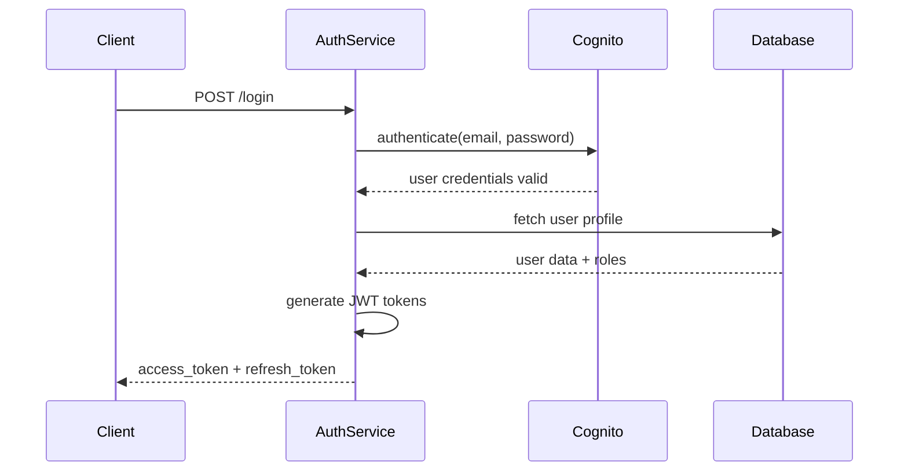
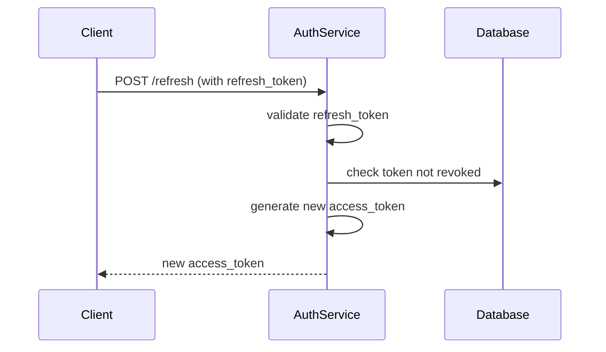
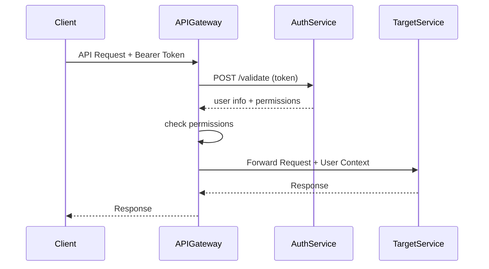

# Auth Service

The Auth Service handles user authentication, authorization, and token management for the Online Bookstore microservices system. It provides JWT-based authentication with refresh token support and integrates with AWS Cognito for user pool management.

## Table of Contents

1. [Overview](#overview)
2. [Technology Stack](#technology-stack)
3. [API Endpoints](#api-endpoints)
4. [Authentication Flow](#authentication-flow)
5. [Database Schema](#database-schema)
6. [Configuration](#configuration)
7. [Local Development](#local-development)
8. [Testing](#testing)
9. [Deployment](#deployment)
10. [Monitoring](#monitoring)

---

## Overview

The Auth Service is a critical component that provides:

- **User Registration**: New user account creation
- **Authentication**: Login with email/password or OAuth providers
- **Token Management**: JWT access tokens and refresh tokens
- **Authorization**: Token validation and scope checking
- **MFA Support**: Multi-factor authentication (future enhancement)
- **Password Reset**: Secure password reset workflows
- **Session Management**: Token blacklisting and session tracking

### Architecture Position

```
┌─────────────────┐    ┌─────────────────┐    ┌─────────────────┐
│   API Gateway   │───▶│   Auth Service  │───▶│  User Service   │
│                 │    │                 │    │  (for profile)  │
└─────────────────┘    └─────────────────┘    └─────────────────┘
        │                        │
        ▼                        ▼
┌─────────────────┐    ┌─────────────────┐
│  AWS Cognito    │    │   PostgreSQL    │
│ (User Pools)    │    │  (Sessions)     │
└─────────────────┘    └─────────────────┘
```

---

## Technology Stack

- **Language**: Java 21 LTS
- **Framework**: Spring Boot 3.2
- **Security**: Spring Security 6.x
- **Database**: PostgreSQL 15 with JPA/Hibernate
- **Authentication**: JWT (JSON Web Tokens)
- **Cloud Integration**: AWS Cognito, AWS Secrets Manager
- **Build Tool**: Maven 3.9+
- **Testing**: JUnit 5, Mockito, Testcontainers
- **Documentation**: OpenAPI 3.1 (Swagger)

---

## API Endpoints

### Base URL
```
http://localhost:8081/api/v1/auth
```

### Authentication Endpoints

#### POST /register
Register a new user account.

**Request Body:**
```json
{
  "email": "user@example.com",
  "password": "SecurePass123!",
  "firstName": "John",
  "lastName": "Doe",
  "acceptTerms": true
}
```

**Response (201 Created):**
```json
{
  "status": "success",
  "data": {
    "userId": "user_abc123",
    "email": "user@example.com",
    "emailVerified": false,
    "createdAt": "2026-01-18T12:27:00Z",
    "verificationToken": "email_verification_token"
  },
  "meta": {
    "timestamp": "2026-01-18T12:27:00Z",
    "correlationId": "req_123456",
    "version": "1.0.0"
  }
}
```

**Error Responses:**
- `400 Bad Request`: Invalid input data
- `409 Conflict`: Email already exists

#### POST /login
Authenticate user and return JWT tokens.

**Request Body:**
```json
{
  "email": "user@example.com",
  "password": "SecurePass123!",
  "rememberMe": false
}
```

**Response (200 OK):**
```json
{
  "status": "success",
  "data": {
    "accessToken": "eyJhbGciOiJIUzI1NiIsInR5cCI6IkpXVCJ9...",
    "refreshToken": "eyJhbGciOiJIUzI1NiIsInR5cCI6IkpXVCJ9...",
    "tokenType": "Bearer",
    "expiresIn": 3600,
    "user": {
      "id": "user_abc123",
      "email": "user@example.com",
      "firstName": "John",
      "lastName": "Doe",
      "roles": ["CUSTOMER"]
    }
  },
  "meta": {
    "timestamp": "2026-01-18T12:27:00Z",
    "correlationId": "req_123456",
    "version": "1.0.0"
  }
}
```

**Error Responses:**
- `400 Bad Request`: Invalid credentials
- `401 Unauthorized`: Account not verified
- `429 Too Many Requests`: Rate limit exceeded

#### POST /refresh
Refresh access token using refresh token.

**Request Body:**
```json
{
  "refreshToken": "eyJhbGciOiJIUzI1NiIsInR5cCI6IkpXVCJ9..."
}
```

**Response (200 OK):**
```json
{
  "status": "success",
  "data": {
    "accessToken": "eyJhbGciOiJIUzI1NiIsInR5cCI6IkpXVCJ9...",
    "tokenType": "Bearer",
    "expiresIn": 3600
  },
  "meta": {
    "timestamp": "2026-01-18T12:27:00Z",
    "correlationId": "req_123456",
    "version": "1.0.0"
  }
}
```

#### POST /logout
Invalidate refresh token (logout).

**Request Headers:**
```
Authorization: Bearer <access_token>
```

**Request Body:**
```json
{
  "refreshToken": "eyJhbGciOiJIUzI1NiIsInR5cCI6IkpXVCJ9..."
}
```

**Response (200 OK):**
```json
{
  "status": "success",
  "data": {
    "message": "Logged out successfully"
  },
  "meta": {
    "timestamp": "2026-01-18T12:27:00Z",
    "correlationId": "req_123456",
    "version": "1.0.0"
  }
}
```

#### POST /validate
Validate JWT token and return user information.

**Request Headers:**
```
Authorization: Bearer <access_token>
```

**Response (200 OK):**
```json
{
  "status": "success",
  "data": {
    "valid": true,
    "user": {
      "id": "user_abc123",
      "email": "user@example.com",
      "roles": ["CUSTOMER"],
      "permissions": ["read:products", "write:orders"]
    },
    "expiresAt": "2026-01-18T13:27:00Z"
  },
  "meta": {
    "timestamp": "2026-01-18T12:27:00Z",
    "correlationId": "req_123456",
    "version": "1.0.0"
  }
}
```

#### POST /forgot-password
Initiate password reset process.

**Request Body:**
```json
{
  "email": "user@example.com"
}
```

**Response (200 OK):**
```json
{
  "status": "success",
  "data": {
    "message": "Password reset email sent",
    "resetToken": "reset_token_for_testing_only"
  },
  "meta": {
    "timestamp": "2026-01-18T12:27:00Z",
    "correlationId": "req_123456",
    "version": "1.0.0"
  }
}
```

#### POST /reset-password
Reset password using reset token.

**Request Body:**
```json
{
  "resetToken": "reset_token_from_email",
  "newPassword": "NewSecurePass123!",
  "confirmPassword": "NewSecurePass123!"
}
```

**Response (200 OK):**
```json
{
  "status": "success",
  "data": {
    "message": "Password reset successfully"
  },
  "meta": {
    "timestamp": "2026-01-18T12:27:00Z",
    "correlationId": "req_123456",
    "version": "1.0.0"
  }
}
```

### Administrative Endpoints

#### GET /users
List users (admin only).

**Query Parameters:**
- `page`: Page number (default: 1)
- `limit`: Items per page (default: 20)
- `status`: Filter by status (active, inactive, suspended)

**Response (200 OK):**
```json
{
  "status": "success",
  "data": [
    {
      "id": "user_abc123",
      "email": "user@example.com",
      "firstName": "John",
      "lastName": "Doe",
      "status": "active",
      "lastLogin": "2026-01-18T12:00:00Z",
      "createdAt": "2026-01-15T10:30:00Z"
    }
  ],
  "meta": {
    "pagination": {
      "page": 1,
      "limit": 20,
      "total": 150,
      "totalPages": 8,
      "hasNext": true,
      "hasPrev": false
    },
    "timestamp": "2026-01-18T12:27:00Z",
    "correlationId": "req_123456",
    "version": "1.0.0"
  }
}
```

#### PATCH /users/{userId}/status
Update user status (admin only).

**Request Body:**
```json
{
  "status": "suspended",
  "reason": "Violation of terms of service"
}
```

### Health Check Endpoints

#### GET /health
Service health check.

**Response (200 OK):**
```json
{
  "status": "UP",
  "components": {
    "db": {
      "status": "UP",
      "details": {
        "database": "PostgreSQL",
        "validationQuery": "SELECT 1"
      }
    },
    "diskSpace": {
      "status": "UP",
      "details": {
        "total": 1073741824,
        "free": 536870912,
        "threshold": 10485760
      }
    }
  }
}
```

#### GET /actuator/health
Detailed Spring Boot health check.

---

## Authentication Flow

### Standard Login Flow



### Token Refresh Flow



### API Request Flow



---

## Database Schema

### Tables

#### users
```sql
CREATE TABLE users (
    id UUID PRIMARY KEY DEFAULT gen_random_uuid(),
    email VARCHAR(255) UNIQUE NOT NULL,
    password_hash VARCHAR(255),
    first_name VARCHAR(100),
    last_name VARCHAR(100),
    status VARCHAR(20) DEFAULT 'pending' CHECK (status IN ('pending', 'active', 'inactive', 'suspended')),
    email_verified BOOLEAN DEFAULT false,
    email_verification_token VARCHAR(255),
    password_reset_token VARCHAR(255),
    password_reset_expires TIMESTAMP,
    last_login TIMESTAMP,
    login_attempts INTEGER DEFAULT 0,
    locked_until TIMESTAMP,
    roles TEXT[] DEFAULT ARRAY['CUSTOMER'],
    created_at TIMESTAMP DEFAULT CURRENT_TIMESTAMP,
    updated_at TIMESTAMP DEFAULT CURRENT_TIMESTAMP
);
```

#### refresh_tokens
```sql
CREATE TABLE refresh_tokens (
    id UUID PRIMARY KEY DEFAULT gen_random_uuid(),
    user_id UUID NOT NULL REFERENCES users(id) ON DELETE CASCADE,
    token_hash VARCHAR(255) UNIQUE NOT NULL,
    expires_at TIMESTAMP NOT NULL,
    revoked BOOLEAN DEFAULT false,
    created_at TIMESTAMP DEFAULT CURRENT_TIMESTAMP,
    revoked_at TIMESTAMP,
    user_agent TEXT,
    ip_address INET
);
```

#### user_sessions
```sql
CREATE TABLE user_sessions (
    id UUID PRIMARY KEY DEFAULT gen_random_uuid(),
    user_id UUID NOT NULL REFERENCES users(id) ON DELETE CASCADE,
    session_id VARCHAR(255) UNIQUE NOT NULL,
    expires_at TIMESTAMP NOT NULL,
    created_at TIMESTAMP DEFAULT CURRENT_TIMESTAMP,
    last_activity TIMESTAMP DEFAULT CURRENT_TIMESTAMP,
    ip_address INET,
    user_agent TEXT
);
```

### Indexes

```sql
-- Users table indexes
CREATE INDEX idx_users_email ON users(email);
CREATE INDEX idx_users_status ON users(status);
CREATE INDEX idx_users_created_at ON users(created_at);

-- Refresh tokens indexes
CREATE INDEX idx_refresh_tokens_user_id ON refresh_tokens(user_id);
CREATE INDEX idx_refresh_tokens_expires_at ON refresh_tokens(expires_at);
CREATE INDEX idx_refresh_tokens_revoked ON refresh_tokens(revoked);

-- Sessions indexes
CREATE INDEX idx_sessions_user_id ON user_sessions(user_id);
CREATE INDEX idx_sessions_expires_at ON user_sessions(expires_at);
```

---

## Configuration

### Environment Variables

| Variable | Description | Default | Required |
|----------|-------------|---------|----------|
| `SPRING_PROFILES_ACTIVE` | Spring profile | `default` | No |
| `JWT_SECRET` | JWT signing secret | - | Yes |
| `JWT_EXPIRATION` | Access token expiration (ms) | `3600000` | No |
| `JWT_REFRESH_EXPIRATION` | Refresh token expiration (ms) | `604800000` | No |
| `SPRING_DATASOURCE_URL` | PostgreSQL connection URL | - | Yes |
| `SPRING_DATASOURCE_USERNAME` | Database username | - | Yes |
| `SPRING_DATASOURCE_PASSWORD` | Database password | - | Yes |
| `AWS_COGNITO_USER_POOL_ID` | Cognito User Pool ID | - | No |
| `AWS_REGION` | AWS region | `us-east-1` | No |
| `REDIS_HOST` | Redis host for sessions | `localhost` | No |
| `REDIS_PORT` | Redis port | `6379` | No |

### Application Properties

```yaml
# application.yml
spring:
  application:
    name: auth-service
  profiles:
    active: ${SPRING_PROFILES_ACTIVE:default}

  datasource:
    url: jdbc:postgresql://${POSTGRES_HOST:localhost}:${POSTGRES_PORT:5432}/${POSTGRES_DB:auth}
    username: ${POSTGRES_USER:auth_user}
    password: ${POSTGRES_PASSWORD:auth_password}
    driver-class-name: org.postgresql.Driver

  jpa:
    hibernate:
      ddl-auto: validate
    show-sql: false
    properties:
      hibernate:
        dialect: org.hibernate.dialect.PostgreSQLDialect
        format_sql: true

  redis:
    host: ${REDIS_HOST:localhost}
    port: ${REDIS_PORT:6379}
    password: ${REDIS_PASSWORD:}
    timeout: 2000ms

jwt:
  secret: ${JWT_SECRET:your-secret-key}
  expiration: ${JWT_EXPIRATION:3600000}
  refresh-expiration: ${JWT_REFRESH_EXPIRATION:604800000}

aws:
  cognito:
    user-pool-id: ${AWS_COGNITO_USER_POOL_ID:}
    region: ${AWS_REGION:us-east-1}

logging:
  level:
    com.bookstore.auth: INFO
    org.springframework.security: DEBUG
  pattern:
    console: "%d{yyyy-MM-dd HH:mm:ss} [%thread] %-5level %logger{36} - %msg%n"
```

---

## Local Development

### Prerequisites

- Java 21 LTS
- PostgreSQL 15
- Redis 7 (optional, for sessions)
- Maven 3.9+

### Setup Steps

1. **Clone and navigate to service**
   ```bash
   cd java-services/auth-service
   ```

2. **Install dependencies**
   ```bash
   ./mvnw dependency:resolve
   ```

3. **Set environment variables**
   ```bash
   export JWT_SECRET="your-development-jwt-secret-key"
   export SPRING_DATASOURCE_URL="jdbc:postgresql://localhost:5432/auth"
   export SPRING_DATASOURCE_USERNAME="auth_user"
   export SPRING_DATASOURCE_PASSWORD="auth_password"
   ```

4. **Run database migrations**
   ```bash
   ./mvnw flyway:migrate
   ```

5. **Start the service**
   ```bash
   ./mvnw spring-boot:run
   ```

6. **Verify service is running**
   ```bash
   curl http://localhost:8081/actuator/health
   ```

### IDE Setup (IntelliJ IDEA)

1. **Import Project**: File → Open → Select `pom.xml`
2. **Configure SDK**: File → Project Structure → Set JDK 21
3. **Run Configuration**:
   - Main class: `com.bookstore.auth.AuthServiceApplication`
   - Environment variables: Set JWT_SECRET, database credentials
   - Working directory: `$PROJECT_DIR$`

### Docker Development

```bash
# Build service
docker build -t auth-service:latest .

# Run with dependencies
docker run --network bookstore-network \
  -e JWT_SECRET="dev-secret" \
  -e SPRING_DATASOURCE_URL="jdbc:postgresql://postgres:5432/auth" \
  -p 8081:8080 \
  auth-service:latest
```

---

## Testing

### Unit Tests

```bash
# Run all unit tests
./mvnw test

# Run specific test class
./mvnw test -Dtest=AuthServiceTest

# Run with coverage
./mvnw test jacoco:report
```

### Integration Tests

```bash
# Run integration tests (requires PostgreSQL)
./mvnw verify -P integration-test

# Run with Testcontainers
./mvnw test -Dtest=*IntegrationTest
```

### Test Categories

```java
// Unit tests
@SpringBootTest
class AuthServiceTest {
    // Tests business logic without external dependencies
}

// Integration tests
@SpringBootTest(webEnvironment = SpringBootTest.WebEnvironment.RANDOM_PORT)
class AuthControllerIntegrationTest {
    // Tests full request/response cycle
}

// Contract tests
@RunWith(SpringRunner.class)
@SpringBootTest
public class AuthServiceContractTest {
    // Tests API contracts with other services
}
```

### Test Database

Tests use Testcontainers for isolated PostgreSQL instances:

```java
@Testcontainers
@SpringBootTest
class AuthServiceIntegrationTest {

    @Container
    static PostgreSQLContainer<?> postgres = new PostgreSQLContainer<>("postgres:15")
            .withDatabaseName("auth_test")
            .withUsername("test")
            .withPassword("test");

    @DynamicPropertySource
    static void configureProperties(DynamicPropertyRegistry registry) {
        registry.add("spring.datasource.url", postgres::getJdbcUrl);
        registry.add("spring.datasource.username", postgres::getUsername);
        registry.add("spring.datasource.password", postgres::getPassword);
    }
}
```

---

## Deployment

### Docker Build

```dockerfile
FROM eclipse-temurin:21-jdk-alpine

WORKDIR /app

COPY pom.xml .
COPY src ./src

RUN ./mvnw dependency:go-offline -B
RUN ./mvnw package -DskipTests

EXPOSE 8080

CMD ["java", "-jar", "target/auth-service-1.0.0.jar"]
```

### AWS ECS Deployment

```yaml
# Task Definition
family: auth-service
containerDefinitions:
  - name: auth-service
    image: ${AWS_ACCOUNT_ID}.dkr.ecr.${AWS_REGION}.amazonaws.com/auth-service:${TAG}
    portMappings:
      - containerPort: 8080
        hostPort: 8080
    environment:
      - name: SPRING_PROFILES_ACTIVE
        value: production
      - name: JWT_SECRET
        valueFrom: arn:aws:secretsmanager:region:account:secret:jwt-secret
    secrets:
      - name: SPRING_DATASOURCE_PASSWORD
        valueFrom: arn:aws:secretsmanager:region:account:secret:db-password
    logConfiguration:
      logDriver: awslogs
      options:
        awslogs-group: /ecs/auth-service
        awslogs-region: ${AWS_REGION}
```

### Environment-Specific Configuration

```yaml
# application-prod.yml
spring:
  datasource:
    url: jdbc:postgresql://auth-db.cluster-xxxx.us-east-1.rds.amazonaws.com:5432/auth

aws:
  cognito:
    user-pool-id: us-east-1_xxxxxxxxx

logging:
  level:
    com.bookstore.auth: WARN
    org.springframework.security: INFO
```

---

## Monitoring

### Health Checks

The service provides comprehensive health checks:

```json
{
  "status": "UP",
  "components": {
    "db": {
      "status": "UP",
      "details": {
        "database": "PostgreSQL",
        "validationQuery": "SELECT 1"
      }
    },
    "redis": {
      "status": "UP",
      "details": {
        "version": "7.0.0"
      }
    },
    "diskSpace": {
      "status": "UP",
      "details": {
        "total": 1073741824,
        "free": 536870912,
        "threshold": 10485760
      }
    }
  }
}
```

### Metrics

The service exposes metrics via Spring Boot Actuator:

- **HTTP Metrics**: Request count, response times, error rates
- **Database Metrics**: Connection pool utilization, query performance
- **JVM Metrics**: Heap usage, GC statistics, thread counts
- **Custom Metrics**: Login attempts, token generation, user registrations

### Logging

Structured JSON logging with correlation IDs:

```json
{
  "timestamp": "2026-01-18T12:27:00Z",
  "level": "INFO",
  "service": "auth-service",
  "correlationId": "req_123456",
  "userId": "user_abc123",
  "action": "LOGIN_SUCCESS",
  "ipAddress": "192.168.1.100",
  "userAgent": "Mozilla/5.0...",
  "message": "User logged in successfully"
}
```

### Alerting

Key alerts configured:

- **High Error Rate**: >5% of requests failing
- **Database Connection Issues**: Connection pool exhausted
- **Token Generation Failures**: JWT signing errors
- **High Memory Usage**: JVM heap >90%
- **Slow Responses**: P95 response time >2s

### Distributed Tracing

Integration with AWS X-Ray for request tracing:

```java
@Configuration
public class TracingConfig {

    @Bean
    public Filter tracingFilter() {
        return new AWSXRayServletFilter("auth-service");
    }
}
```

---

## Security Considerations

### Authentication Security

- **Password Hashing**: BCrypt with salt and multiple rounds
- **JWT Security**: HMAC-SHA256 signing with strong secrets
- **Token Expiration**: Short-lived access tokens (1 hour) with refresh tokens (7 days)
- **Token Blacklisting**: Compromised refresh tokens can be revoked

### Authorization

- **Role-Based Access Control**: CUSTOMER, ADMIN roles
- **Scope-Based Permissions**: read:users, write:users, admin:all
- **Resource-Level Permissions**: User can only access their own data

### Data Protection

- **Encryption at Rest**: Database encryption for sensitive data
- **HTTPS Only**: All communications over TLS 1.2+
- **Input Validation**: Comprehensive validation of all inputs
- **SQL Injection Prevention**: Parameterized queries only

### Operational Security

- **Secret Management**: AWS Secrets Manager for all secrets
- **Audit Logging**: All authentication events logged
- **Rate Limiting**: Protection against brute force attacks
- **Account Lockout**: Progressive delays on failed login attempts

---

## Troubleshooting

### Common Issues

#### Database Connection Failures

```bash
# Check database connectivity
psql -h localhost -U auth_user -d auth -c "SELECT 1;"

# Check application logs
docker-compose logs auth-service | grep ERROR

# Verify environment variables
docker-compose exec auth-service env | grep DATABASE
```

#### JWT Token Issues

```bash
# Validate JWT token structure
# Use jwt.io debugger to inspect tokens

# Check JWT secret consistency
echo $JWT_SECRET | wc -c  # Should be >32 characters
```

#### High Memory Usage

```bash
# Check JVM heap usage
docker-compose exec auth-service jcmd 1 VM.native_memory summary

# Enable GC logging
JAVA_OPTS="-XX:+PrintGCDetails -XX:+PrintGCTimeStamps"
```

### Debug Mode

Enable debug logging for troubleshooting:

```yaml
logging:
  level:
    com.bookstore.auth: DEBUG
    org.springframework.security: DEBUG
    org.springframework.web: DEBUG
```

### Performance Tuning

```yaml
# Database connection pool tuning
spring:
  datasource:
    hikari:
      maximum-pool-size: 20
      minimum-idle: 5
      idle-timeout: 300000
      max-lifetime: 1200000

# JWT caching
jwt:
  cache:
    enabled: true
    size: 10000
    ttl: 300000
```

---

This Auth Service provides a robust, scalable authentication and authorization system that integrates seamlessly with the broader microservices architecture while maintaining high security standards and operational excellence.